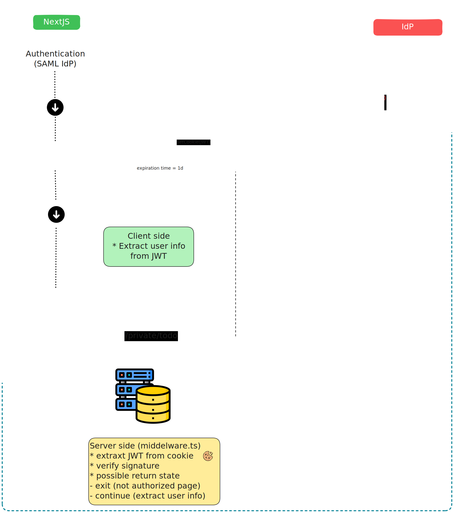
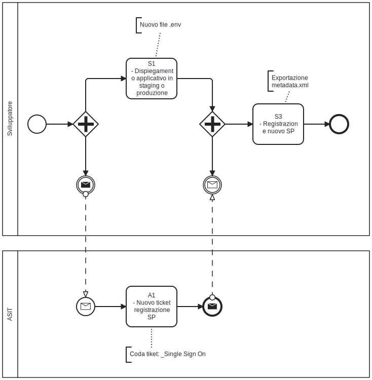

# Autenticazione e autorizzazione

Il sistema di autenticazione di **SOUL** è progettato in conformità con le linee guida ufficiali fornite da **NextJS**, seguendo le best practice presenti nella documentazione alla voce [`Guide > Autentication`](https://nextjs.org/docs/pages/guides/authentication). In particolare, per garantire la sicurezza e l'interoperabilità dei sistemi, l'infrastruttura prevede l'integrazione con il **Single Sign-On (SSO) di Ateneo**, quale meccanismo centrale per la gestione delle identità e delle sessioni utente. L'integrazione viene attivata al momento del rilascio delle nuove applicazioni in ambienti differenti da quello di sviluppo, assicurando così che tutte le nuove istanze dell'applicazione siano vincolate al sistema di autenticazione istituzionale. E' prevista una procedura formale di accreditamento del nuovo sistema presso il team che gestisce l'Identity Provider SAML (da ora IdP). La registrazione è necessaria per completare il processo di integrazione dei nuovi applicativi. Nel linguaggio SAML, le nuove applicazioni vengono chiamate  Service Provider (da ora SP). Per agevolare le attività di sviluppo e test, l'ambiente di sviluppo di SOUL mette a disposizione un **IdP di Mockup**, che consente di simulare il comportamento del sistema di autenticazione senza dover procedere immediatamente alla registrazione ufficiale nell'IdP. Questo approccio consente ai team di sviluppo di lavorare in modo autonomo e flessibile, garantendo al contempo la piena compatibilità e conformità in fase di rilascio.

## Identità dell'utente e gestione della sessione

Le applicazioni sviluppate con SOUL devono utilizzare l'IdP di Ateneo.  Il flusso di autenticazione e autorizzazione si  articola in più fasi, orchestrate tra applicazione lato client (Browser), applicazione lato server Next.js (SP) e server che contiene le identità degli utenti (IdP). Autenticazione e autorizzazione in SOUL si declinano rispetto alle [linee guida di autenticazione di NextJS](https://nextjs.org/docs/pages/guides/authentication#stateless-sessions) come segue:

* **Authentication**: la verifica dell'identità dell'utente è demandata all'IdP di Ateneo;
* **Session management**: è **stateless**. I dati della sessione e l'identità dell'utente sono salvati in un cookie. Mantenere la sessione stateless è conveniente in caso di dispiegamento negli ambienti cloud di Ateneo (ovvero con architettura PaaS e contenitori ephimeral);
* **Authorization**: l'autorizzazione è di tipo **secure**. In ogni pagina dell'applicazione vengono eseguiti dei controlli sulla base dei permessi memorizzati nella sessione utente. Il cookie di sessione contiene l'elenco dei permessi dell'utente autenticato. A partire da questi permessi, è possibile implementare controlli mirati nelle pagine (React Server Components) che necessitano di autorizzazione.

Per entrare nel dettaglio del **flusso di autenticazione**, quando un utente tenta di accedere ad una rotta protetta (es. `/secure/request`), viene reindirizzato all’IdP per effettuare il login. L’IdP verifica le credenziali dell’utente e restituisce un token SAML 2.0 all’applicazione. Questo token viene poi convertito in forma di JWT (firmato). Il JWT aiuta a trasportare i dati di identità dell’utente in modo sicuro e compatto. Il JWT viene memorizzato in un cookie di sessione, generalmente con attributi `HttpOnly`, `Secure` e `SameSite` per mitigare rischi come XSS e CSRF.

A ogni richiesta verso una rotta protetta, il middleware lato server di Next.js intercetta la richiesta, estrae il JWT dal cookie e ne verifica la firma. Se la firma nel token è valida, il middleware consente l’accesso alla  risorsa. Se la firma nel token è assente, scaduta o non valida, l’utente viene  reindirizzato ad una pagina di errore o al login. Lato client il coookie di sessione non può essere letto (`HttpOnly`) . Di conseguenza le informazioni utente possono essere recuperate unicamente lato server. Le informazioni ricavate dal JWT consentono di personalizzare l’interfaccia utente in base al profilo autenticato.

Il vantaggio di questo approccio è che il riconoscimento dell'utente è delegato ad un IdP esterno. L’uso di cookie di sessione consente un’architettura stateless,  scalabile e facilmente integrabile con altri servizi. Inoltre, l’intero  flusso è compatibile con standard enterprise come SAML e può essere  esteso per supportare OAuth2 o OpenID Connect. Questo modello è  particolarmente adatto per applicazioni moderne che richiedono  sicurezza, modularità e interoperabilità con sistemi di identità aziendali.



### Tipi di identità restituite dall'IdP

Il processo di autenticazione SSO all’Università degli Studi di Padova si basa su un IdP conforme a SAML 2.0, che fornisce un insieme di  attributi specifici a seconda della tipologia dell’utente e della modalità con cui si autentica nel SP. Gli utenti possono essere interni  (studenti o dipendenti) oppure esterni (autenticati tramite: SPID; CIE; IDEM). Gli utenti interni si autenticano all’IdP locale e ricevono un insieme di attributi che include identificatori esterni e interni (`shib_extid`, `shib_id`), codice fiscale (`shib_codicefiscale`), nome e cognome (`shib_givenname`, `shib_sn`) e soprattutto l’**indirizzo email** (`shib_mail`), che funge da identificatore univoco. Un attributo chiave è `shib_authsource`, che in questo caso è sempre valorizzato a `LOCAL`. Per distinguere tra studenti e dipendenti, è necessario analizzare il  dominio dell’indirizzo email: gli studenti hanno email che terminano con `@studenti.unipd.it`, mentre i dipendenti usano `@unipd.it`. Questo permette di classificare correttamente l’utente e applicare le relative regole di accesso.

Gli utenti esterni, invece, si autenticano tramite sistemi federati con l'Ateneo come: SPID; CIE; Idem. In questi casi, l’IdP fornisce un set di attributi  differente a seconda della federazione. Nel caso della deferazione con il sistema nazionale di identità digitale italiano, in fase di risposta l'IdP include un codice identificativo SPID (`spid_spidCode`), il codice fiscale (`spid_fiscalNumber`), un eventuale codice IVA (`spid_ivaCode`) e l’indirizzo email (`spid_email`), che anche qui funge da identificatore univoco. L’attributo `shib_authsource` è valorizzato rispettivamente a `SPID` o `CIE`, a seconda del metodo utilizzato.  Se l'utente è registrato nel sistema nazionale di identità digitale italiano e anche nei sistemi dell'Ateneo, allora l'IdP ritorna anche gli attributi personali memorizzati dai sistemi di identità dell'Ateneo.

Dal punto di vista dello sviluppatore, è fondamentale implementare  controlli robusti sugli attributi ricevuti dall' IdP. In particolare, è necessario validare il valore di `shib_authsource` per  determinare la provenienza dell’autenticazione, analizzare il dominio  dell’email per classificare correttamente l’utente interno, e verificare la presenza delle condizioni di registrazione e autorizzazione per gli  utenti esterni. L’indirizzo email (`shib_mail` o `spid_email`) deve essere trattato come chiave primaria per l’identificazione  dell’utente. Questo approccio consente di gestire in modo sicuro e  coerente l’accesso ai servizi digitali dell’Ateneo, garantendo al  contempo flessibilità nell’integrazione con fonti di identità esterne.



Segue il riferimento agli attributi che devono essere restituiti dall'IdP in linguaggio SAML per realizzare l'autenticazione. 

```xml
<!--
	Questo file è stato adattato a partire dal file attribute-map.xml.
	Per avere l'elenco completo degli attributi presenti nel file attribute-map.xml
 	e messi a disposizione dall'IdP, va fatta richiesta al team che gestisce l'IdP.
-->

<Attributes xmlns="urn:mace:shibboleth:2.0:attribute-map" xmlns:xsi="http://www.w3.org/2001/XMLSchema-instance">
    <!-- c'è sempre per utenze interne e IDEM, non per SPID/CIE -->
    <Attribute name="urn:oid:2.5.4.42" id="shib_givenname"/> <!-- SOUL: firstName -->
		<!-- .... -->
    <Attribute name="urn:oid:2.5.4.4" id="shib_sn"/> <!-- SOUL: familyName -->
    <!-- .... -->
    <!-- c'è sempre per utenze interne e IDEM, non per SPID/CIE -->
    <Attribute name="urn:oid:0.9.2342.19200300.100.1.3" id="shib_mail"/> <!-- SOUL: mail, SOUL: id -->
    <!-- .... -->
  	<Attribute name="https://www.cca.unipd.it/sso/attributes/codicefiscale" id="shib_codicefiscale"/> <!-- SOUL: codiceFiscale -->
  	<!-- .... -->
  	<Attribute name="www.cca.unipd.it/sso/attributes/externalid" id="shib_extid"/>   <!-- SOUL: externalId -->
  	<!-- .... -->
  
 </Attributes>
```

## Workflow di integrazione

Per integrare correttamente il sistema è necessario creare un nuovo file `.env`, che contiene le configurazioni essenziali. Le principali chiavi da configurare sono:

- **SSO_PROVIDER**, ovvero l'IdP al quale deve essere registrato l'SP. La registrazione può avvenire per diversi ambienti (`local` = Mockup, `unipd_test` = Unipd di Test,  `unipd` = Unipd di Produzione );
- **SSO_SP_ENTITY_ID**, che rappresenta l'identificativo con cui registrare l'SP presso l'IdP. Per convenzione, questo valore corrisponde al `BASE_URL`;
- **BASE_URL**, ossia l'indirizzo completo (incluso protocollo e dominio) tramite il quale l'applicativo sarà raggiungibile dal browser (eg. `https://booking-requests.ict.unipd.it`);
- **SP_PRIVATE_KEY** e **SP_CERT_KEY**, che sono le chiavi necessarie per garantire una comunicazione sicura tra Browser, SP e IdP.

All'interno dello [Starter Kit](https://github.com/Piattaforme-Applicativi/soul-starter-kit) è disponibile un'interfaccia utente che semplifica la generazione del file di configurazione. L'interfaccia utente è raggiungibile nell'applicazione al path `/configuration/new`.

Dopo aver creato correttamente il file `.env`, si può procedere con il dispiegamento del sistema sia in ambiente di staging che in produzione. Una volta che il sistema è operativo e raggiungibile tramite l'indirizzo configurato in `BASE_URL`, è possibile scaricare il file di metadata che identifica l'SP accedendo al path `/saml/metadata`.

A questo punto, con il file di metadata disponibile, è possibile completare la registrazione del nuovo SP presso l'IdP di Ateneo. Prima di accedere alla [pagina di richiesta di accreditamento Single Sign On di Ateneo](https://registrazionisp.ict.unipd.it/form/richiestesso), è necessario riceve un nuovo codice di invito (**Invitation Code**) scrivendo alla [coda ticket di Ateneo](https://helpdesk.ammcentr.unipd.it/otrs/customer.pl?OTRSCustomerInterface=oBbwZal2mXfTD3xE9GABt7nCH0MNaaPD).



Un possibile messaggio per chiedere l'Invitation Code nella coda ticket _Single Sign On potrebbe essere:

> Buongiorno,
>
> stò completando l'attività di integrazione dell'ambiente staging per il nuovo
> sistema "xxx" con l'Idednti Provider SAML di Ateneo.
>
> Mi servirebbe Invitation Code per formulare la domanda online "Richieste
> accreditamento Single Sign-On di Ateneo - UniPD"
>
> Un caro saluto

### Compiti dello sviluppatore

Segue l'elenco delle attività che lo sviluppatore deve portare a termine per integrare i nuovi applicativi con l'IdP di Ateneo.

| Codice | Nome del compito                                             | Descrizione del compito                                      |
| :----: | ------------------------------------------------------------ | ------------------------------------------------------------ |
|   S1   | Dispiegamento applicativo in ambiente di staging e produzione | Lo sviluppatore crea un nuovo file  `.env`  per gli ambienti di produzione o di staging. Lo sviluppatore dispiega il nuovo applicativo negli ambienti di staging o di produzione. |
|   S2   | Nuovo ticket registrazione SP                                | Lo sviluppatore richiede un **Invitation Code** per completare la richiesta di accreditamento Single Sign On di Ateneo nella **coda ticket _Single Sign On** dell'Ateneo. |
|   S3   | Registrazione nuovo SP                                       | Lo sviluppatore scarica dal nuovo applicativo dispiegato in staging o produzione il file `/saml/metadata` che identifica l' applicativo come SP.  Lo sviluppatore in possesso di **Invitation Code** e del file XML che identifica il nuovo applicativo / SP, invia una nuova  richiesta di accreditamento. |

#### S3 - Registrazione di un nuovo SP

Al momento dell'invio della [richiesta di accreditamento Single Sign On di Ateneo](https://registrazionisp.ict.unipd.it/form/richiestesso) è necessario porre attenzione a queste informazioni richieste nella form:

* **Invitation Code**: ottenuto al passo S2;
* **Metadata SP**: è il file XML che può essere scaricato dal path `/saml/metadata`  dell'istanza dell'applicazione;
* **Attributi richiesti**: sono gli attributi necessari a creare il JWT nel cookie di sessione. Gli attributi che devono essere obbligatoriamente richiesti sono: shib_codicefiscale, shib_extid, shib_sn, shib_givenname, shib_mail;
* **Note eventuali**: deve essere utilizzato nel caso in cui è necessario abilitare l'autenticazione con il sistema nazionale di identità digitale italiano.

# Esempio di utilizzo di identità e permessi 

L'identità dell'utente è utile in quegli scenari nei quali è necessario limitare l'acesso ai dati all'utente che stà utilizzando il sistema. I dati all'identità dell'utente sono custoditi in sessione. La funzione `payload()` ritorna i dati utente che vengono memorizzati nella rotta `/saml/post-response`, a seguito della verifica delle credenziali dell'utente nell'IdP. I dati dell'identità sono memorizzati nel cookie di sessione e possono essere recuperati dallo stesso solo lato server.

```jsx
"use server";
// ....
import { Session } from "@/types/session";
import { AuthUser } from "@/types/auth-user";
// ....

// ....
const user: AuthUser = await Session.payload();
// ....
```

I permessi vengono utilizzati per limitare l'accesso ai dati. I permessi vengono eriditati dal ruolo dell'utente. Ci sono due modi per verificare se l'utente è in possesso di un ruolo. Lato server la funzione `isAuthorized()` utilizza l'identità utente per verificare se un permesso è presente nel cookie di sessione.

```jsx
// nextjs/app/secure/request/page.tsx

"use server";

import { getSessionPayload } from "@/components/user/actions";
import { AuthUser } from "@/types/auth-user";
import { permissionType } from "@prisma/client";
import { isAuthorized } from "@/components/common/utils";
// ...

export default async function Page() {
  const user: AuthUser | null = await getSessionPayload();
  // ...
  return (
    <>
      <!-- <meta /> ... -->
      {!isAuthorized(user, permissionType.requestRead) ? (
          <UserNotAuthorized />
        ) : (
          <MyRequests requests={myRequests()} / >
        )}
    </>
  );
}
```

Lato client  il metodo `isAuthorized()` è messo a disposizione dal componente `<AuthProvider/>`. In questo caso **non è necessario specificare il parametro utente**.

```jsx
"use client";

// ...
import React, { useContext } from "react";
import AuthContext from "@/components/context/auth-context";
import { permissionType } from "@prisma/client";
// ...

export default function RequestListItem(props: { request: Request }) {
  const { isAuthorized } = useContext(AuthContext);
	// ...
  return (<>
            <!--

            -->
            {isAuthorized(permissionType.requestList) && (
                   <li className="nav-item dropdown">
            <!--

            -->
    </>);
}
```

