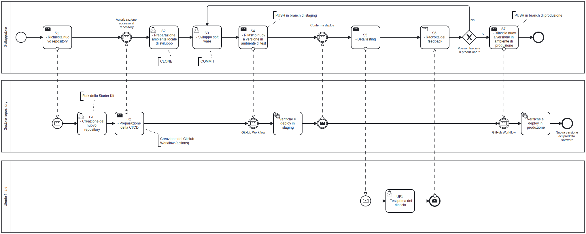
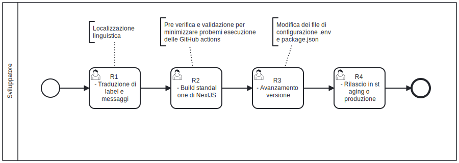

# Rilascio e versionamento

Le applicazioni sviluppate con lo [Starter Kit](https://github.com/Piattaforme-Applicativi/soul-starter-kit) SOUL prevedono una **prima fase di sviluppo** che avviene  localmente nel proprio computer e una **seconda fase di dispiegamento** negli ambienti cloud di Ateneo. Il modello di sviluppo iterativo ha l'obiettivo di migliorare il prodotto software raccogliendo i feedback degli utenti ad ogni iterazione. La parte di dispiegamento negli ambienti di staging e produzione è automatizzata, utilizzando le [GitHub Actions](https://docs.github.com/en/actions) ovvero la CI/CD di GitHub. E' importante annotare la versione del prodotto software che viene rilasciato negli ambienti di staging e produzione per verificare il corretto rilascio della nuova versione del sistema nei diversi ambienti.

## Ciclo di vita

Il processo di sviluppo ha inizio con la richiesta del team di sviluppo. Il team di sviluppo richiede la creazione di un nuovo repository, per i sorgenti del prodotto software, ai gestori dei repository di Ateneo. Dopo aver scelto il nome del repository insieme al fornitore, i gestori dei repository creano il nuovo repository come fork dello [Starter Kit](https://github.com/Piattaforme-Applicativi/soul-starter-kit) e preparano le procedure per la CI/CD per dispiegare l'applicativo negli ambienti cloud. Quando la CI/CD è pronta il team di sviluppato riceve una notifica e può clonare il repository per dare inizio alla fase di implementazione del nuovo prodotto software. Da questo momento il team di sviluppo può rilasciare le nuove funzionalità del software eseguendo il PUSH nel repository remoto. Effettuando il PUSH nel **branch develop** il prodotto viene dispiegato nell'ambiente di staging. Il prodotto software può essere mostrato al cliente finale per raccogliere feedback. A seguito delle indicazioni dell'utente finale il team di sviluppo può decidere se ritornare alla fase dello sviluppo o rilasciare la nuova versione del software nell'ambiente produzione effetuando il PUSH nel **branch main**. 

### Scelta dei nomi dei domini e dei repository

Nella fase iniziale del progetto di sviluppo è necessario scegliere il nome del repository GIT e dei nomi a dominio per raggiungere via browser gli ambienti di staging e di produzione. E' una convezione interna scegliere il nome del repository GIT secondo il formato [Kebab case](/stile-codice#glossario). Per quanto riguarda i nomi a dominio vanno rispettate le [linee guida per la registrazione dei nomi a dominio dell'Ateneo](https://www.unipd.it/domini). Per ragioni di gestione, se possibile, è preferibile scegliere i nomi a dominio per gli ambienti di staging in produzione in questo modo:

* **staging** - deve essere registrato un nome a dominio di 4° livello,  il nome dell'applicativo in formato [Kebab case](/stile-codice#glossario) deve essere seguito dal suffisso *-staging.ict.unipd.it*  (eg. {nuovo-software}-staging.ict.unipd.it)
* **produzione** - deve essere registrato un nome a dominio di 4° livello,  il nome dell'applicativo in formato [Kebab case](/stile-codice#glossario) deve essere seguito dal suffisso *.ict.unipd.it*  (eg. {nuovo-software}.ict.unipd.it)

La scelta dei nomi a dominio è rilevante per la fase di integrazione dell'applicativo con l'Identity Provider di Ateneo.

### Compiti dello sviluppatore

Segue l'elenco dei compiti che lo sviluppatore deve svolgere per rilasciare un nuovo applicativo in  negli ambienti di staging e produzione nel cloud di Ateneo.

| Codice | Nome del compito                                 | Descrizione del compito                                     |
| :----: | ------------------------------------------------- | ------------------------------------------------------------ |
|   S1   | Richiesta nuovo repository                        | Lo sviluppatore deve inviare una comunicazione all'indirizzo helpdesk@donq.io ( il gestore dei repository ), chiedendo di creare un repository per il nuovo progetto/prodotto software. All'interno della comunicazione vanno riportati anche i nomi dei domini per l'ambiente di staging e produzione, come riportato nella sezione [scelta dei nomi dei domini e dei repository](#scelta-dei-nomi-dei-domini-e-dei-repository) |
|   S2   | Preparazione ambiente locale di sviluppo          | A seguito della ricezione della **comunicazione di conferma di crezione del nuovo repository** da parte del gestore dei repository, lo sviluppatore può [installare e configurare l'ambiente di lavoro locale](/installazione) |
|   S3   | Sviluppo software                                 | Lo sviluppatore implementa una [nuova versione del sistema](#annotazione-nuova-versione) per rispondere ai requisiti o per correggere dei difetti del prodotto software |
|   S4   | Rilascio nuova versione in ambiente di test       | Lo sviluppatore esegue il GIT PUSH dei COMMIT nel **branch sviluppo**. Se tutte le modificano superano i test automatici di verifica e validazione, la [nuova versione](#annotazione-nuova-versione) del prodotto software viene dispiegata nell'ambiente di **staging** |
|   S5   | Beta testing                                      | Lo sviluppatore esegue una verifica della nuova versione dell'applicativo Insieme agli utenti finali e raccoglie feedback |
|   S6   | Raccolta dei feedback                             | A fronte dei feedback raccolti, lo sviluppatore insieme all'utente finale decide se la [nuova versione](#annotazione-nuova-versione) del sistema può essere rilasciata in produzione |
|   S7   | Rilascio nuova versione in ambiente di produzione | Lo sviluppatore esegue il GIT PUSH dei COMMIT nel **branch main**. Se tutte le modificano superano i test automatici di verifica e validazione, la [nuova versione](#annotazione-nuova-versione) del prodotto software viene dispiegata nell'ambiente di **produzione** |

### Sviluppatori interni all'Ateneo

Gli sviluppatori che fanno parte dello staff di Ateneo, possono decidere di creare in autonomia i repository dei progetti software basati su [Starter Kit](https://github.com/Piattaforme-Applicativi/soul-starter-kit) SOUL. Per fare questo lo sviluppatore in staff all'Ateneo può mandare una comunicazione all'indirizzo soul.applicativi@unipd.it , chiedendo l'autorizzazione a creare nuovi repository per i nuovi progetti software. A seguito dell'autorizzazione da parte del gestore dei repository di Ateneo, lo sviluppatore può creare nuovi repository come fork dello [Starter Kit](https://github.com/Piattaforme-Applicativi/soul-starter-kit) SOUL. **Prima di rilasciare il prodotto** negli ambienti di staging e di produzione, lo sviluppatore deve inviare una comunicazione all'indirizzo helpdesk@donq.io ( gestore dei repository ) per richiedere l'attiviazione della CI/CD per il nuovo prodotto software. Nella comunicazione devono essere indicati anche i nomi dei domini per l'ambiente di staging e produzione, come riportato nella sezione [scelta dei nomi dei domini e dei repository](#scelta-dei-nomi-dei-domini-e-dei-repository). 

## Rilascio delle nuove versioni 

Prima di ogni rilascio delle applicazioni basate su [Starter Kit](https://github.com/Piattaforme-Applicativi/soul-starter-kit) SOUL è necessario:

* Tradurre i messaggi di sistema in lingua italiana, come riportatato nelle [linee guida alla localizzazione linguistica](/localizzazione);
* Eseguire il pre-build delle sorgenti NextJS nel proprio computer per minimizzare o eliminare gli errori di CI/CD;
* Annotare la nuova versione del sistema, semplificando l'attività di verifica di aggiornamenti degli ambienti di staging e produzione.

### Pre-build delle sorgenti NextJS

Quando lo sviluppatore esegue il GIT PUSH dei COMMIT nel branch develop, attiva la CI/CD che verifica e valida il codice sorgente. Il dispiegamento dell'applicativo nell'ambiente di staging e produzione prevede che venga prodotta un versione minimale del server NextJS (microservizio interfacce utente). La creazione di questo server minificato segue le [regole di transpilazione Javascipt degli applicativi NextJS](https://nextjs.org/docs/app/api-reference/config/next-config-js/output). E' buona prassi eseguire la compilazione/transpilazione delle sorgenti nell'ambiente di sviluppo prima di effettuare il GIT PUSH, per ridurre il numero di errori che si possono verificare durante la CI/CD.

La modalità "standalone" di NextJS produce una versione bundled dell'applicazione riducendo i tempi di transpilazione da Typescript a Javascript. La versione bundled inoltre "incorpora" solo le parti di librerie o dei pacchetti necessarie al funzionamento del sistema.

Segue l'elenco delle operazioni da eseguire per eseguire il buil localmente::

- ferma l'esecuzione dei container con **docker compose down**
- modifica il file nextjs/.env impostando **NODE_ENV=production**
- effettua il build standalone **docker compose run nextjs npm run build**

Se il build viene eseguito senza errori è possibile testare localmente la versione standalone del sistema, modificando la sezione nextjs del file docker-compose.yml. La sotto sezione  **command: npm run dev** va modificata in **command: npm run start**.

Un volta verificato che il build viene eseguito correttamente è preferibile ripristinare l'ambiente alla sua versione originale:

- modifica il file nextjs/.env impostando **NODE_ENV=development**

### Annotazione nuova versione

Prima dei rilasci è conveniente annotare l'incremento della versione del prodotto software. Oltre ai tradizionali vantaggi offerti dal versionamento dei prodotti software, l'annotazione è utile per capire se la CI/CD ha funzionato correttamente. L'interfaccia utente dello [Starter Kit](https://github.com/Piattaforme-Applicativi/soul-starter-kit) riporta la versione del sistema. In questo modo una volta eseguito il GIT PUSH nel branch develop o nel branch main, è sufficiente attendere l'esecuzione della CI/CD e controllare che la versione del sistema sia cambiata.

Per aggiornare la versione del software è necessario modificare i due file:

* .env - incremento della versione del sistema, quando almeno uno dei micorservizi è stato modificato;
* nextjs/package.json - quando si sviluppano nuove funzionalità o nel caso di BUGFIX, nel microservizio NextJS.

Seguono le convenzioni adottate per l'annotazione dei rilasci di nuove versioni del prodotto software. Dato un numero di versione espresso nel formato MAJOR.MINOR.PATCH, l'incremento di versione è :

- MAJOR quando vengono fatte delle manutenzioni che modificano in comportamento delle API (integrazioni offerte da questo sistema ad altri sistemi);
- MINOR quando vengono aggiunte dell funzionalità in maniera retrocompatibile (senza side effects rispetto ad altri sistemi che si integrano con il nostro sistema);
- PATCH quando vengono eseguiti BUGFIX in modo retrocompatibile (senza side effects rispetto ad altri sistemi che si integrano con il nostro sistema).

E' possibile consultare il formato MAJOR.MINOR.PATCH all'indirizzo https://semver.org/lang/it/, per aggiungere informazioni aggiuntive alla norma/formato di versionamento del prodotto software.

