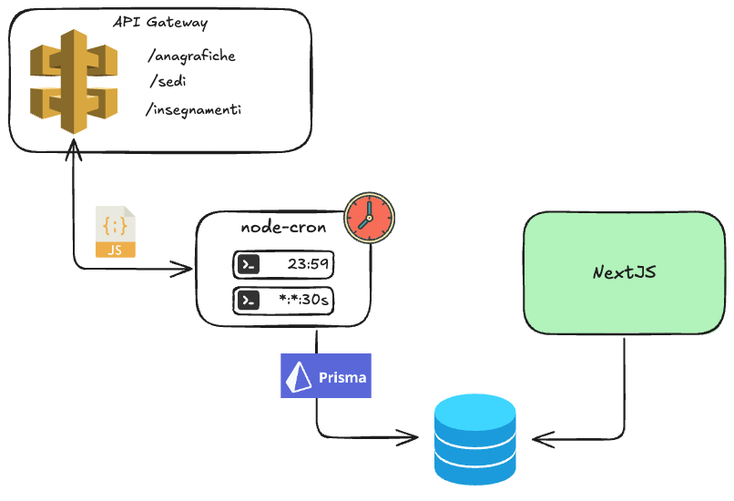

# Cronjobs
Nello sviluppo di applicazioni web basate su SOUL, ci sono situazioni in cui alcune attività devono essere eseguite in modo ricorrente, pianificato o indipendente dall’interazione dell’utente. In questi casi, l’impiego di *cronjob* – ovvero processi batch schedulati nel tempo – diventa fondamentale.

I cronjob permettono di automatizzare compiti ricorrenti, spesso ad alta intensità di calcolo o che non richiedono una risposta immediata all’utente. Queste operazioni vengono eseguite in background secondo una pianificazione definita (ad esempio ogni ora, una volta al giorno, o ogni lunedì alle 3 del mattino), liberando così l’applicazione web da carichi di lavoro pesanti durante l’uso normale e migliorando l’esperienza utente complessiva.

Ecco alcuni casi d’uso tipici in cui i cronjob trovano applicazione:

- **Invio di email programmate**: newsletter, notifiche settimanali o promemoria automatici vengono spesso generati ed inviati tramite job schedulati.
- **Pulizia e manutenzione dati**: eliminazione di dati temporanei, log vecchi, o sessioni scadute sono compiti ideali per processi pianificati.
- **Elaborazioni asincrone intensive**: generazione di report, esportazione di dati, indicizzazione full-text o sincronizzazione con sistemi esterni richiedono spesso risorse elevate e vengono quindi delegate a processi batch.
- **Aggiornamenti di cache o dati aggregati**: allo scopo di garantire un buon grado di disaccoppiamento dei sistemi, può essere conveniente sincronizzare collezioni di dimensioni gestibili dalla base dati locale (eg. elenco delle sedi, insegnamenti, personale strutturato, funzioni e incarichi) 

Non tutte le operazioni devono essere affidate a cronjob: se un’attività deve avvenire in risposta diretta a un’azione dell’utente (come l’invio di una conferma dopo una registrazione), è preferibile gestirla in tempo reale. Tuttavia, quando un’operazione può essere rimandata o pianificata senza influire sull’esperienza dell’utente, i cronjob rappresentano la soluzione più efficiente e scalabile.

In conclusione, integrare cronjob in modo strategico è una buona pratica che consente di bilanciare meglio i carichi di lavoro, ottimizzare le risorse e mantenere l'applicazione reattiva. È quindi importante che ogni team di sviluppo conosca le potenzialità dei processi batch e sappia quando e come impiegarli efficacemente.

# Linee guida per la realizzazione di **cronjob** compatibili con gli ambienti cloud di Ateneo

Per garantire la compatibilità con gli ambienti cloud dell’Ateneo, **tutti i cronjob devono essere implementati utilizzando il modulo [`node-cron`](https://www.npmjs.com/package/node-cron)**. Di seguito alcune indicazioni progettuali e implementative da tenere in considerazione durante lo sviluppo:

- **Accesso a database e filesystem** - è obbligatorio utilizzare **Prisma ORM** per l’interazione con la base dati dell’applicazione. Per favorire il disaccoppiamento tra componenti, si raccomanda di **evitare l’utilizzo delle API esposte dal microservizio frontend**;
- **Atomicità dei job** - ogni job deve essere progettato per essere **atomicamente eseguibile**: deve completare tutte le operazioni previste o fallire senza lasciare l’applicativo in uno stato incoerente o parzialmente aggiornato;
- **Performance ed efficienza** - anche se si tratta di processi eseguiti in modo asincrono e potenzialmente schedulati a intervalli ampi, è fondamentale che i job siano **ottimizzati per ridurre al minimo i tempi di esecuzione**, evitando elaborazioni ridondanti o non necessarie;
- **Logging strutturato ed efficace** - è responsabilità dello sviluppatore integrare **log chiari e significativi** nei job, in modo da facilitare il tracciamento di eventuali malfunzionamenti. È importante **evitare un eccesso di messaggi di debug non rilevanti**, poiché potrebbero ostacolare l’individuazione delle reali cause di errore;
- ⚠ **Ricordatevi di informare i gestori dell'intrastruttura** - l'utilizzo dei job non è un comportamento dei base del cloud di Ateneo. **Prima del dispiegamento** è necessario informare i gestori dell'infrastruttura che va pianificata l'esecuzione di un `node-cron container`,  scrivendo all’indirizzo `helpdesk@donq.io` 

Lo **Starter Kit** fornito include un esempio di organizzazione dei microservizi per applicazioni containerizzate. In particolare, il **container `cronjob`** è stato predisposto per simulare il comportamento reale dei processi batch in ambiente di sviluppo. Questo container:

- riproduce le **limitazioni tipiche degli ambienti cloud di Ateneo**;
- permette allo sviluppatore di **verificare in locale la correttezza e la compatibilità dei cronjob** prima del deploy in ambienti di staging o produzione.

L’adozione di questo approccio consente di **aumentare l’affidabilità e la prevedibilità del comportamento dei job schedulati**, lungo tutto il ciclo di vita dell’applicazione.



# Esempio di utilizzo

Per testare l'esecuzione di cronjob personalizzati con lo Starter Kit è sufficiente modificare il file `cronjob/jobs.ts` dichiarando un nuovo intervallo di esecuzione.

```ts
import cron from "node-cron";
import Prisma from "@/libs/prisma";

const prisma = Prisma.getInstance().client;

cron.schedule("* * * * *", () => {
  // Declare here your ETL
  // prisma.todo.findMany().then((todos) => {
  //   console.log(todos);
  // });
  console.log("running a task every minute");
});
```

Per simulare il funzionamento di un job durante lo sviluppo è consigliato:

1) aggiungere una cartella `cronjob/jobs/`
2) aggiungere un nuovo job `cronjob/jobs/example.ts` con una funzione `run` per eseguire il job
3) verificare il funzionamento del job `docker exec -it todo-cronjob node --import=tsx -e "import('@/jobs/example').then(m => m.run())"`
4) quando il job funziona puoi aggiungerlo agli intervalli e ricarire l'ambiente per testarne il funzionamento programmato `docker compose restart cronjob`

Segue un esempio di un nuovo job 

```ts
import Prisma from "@/libs/prisma";

const prisma = Prisma.getInstance().client;

export async function run() {
  // Your job logic goes here
  console.log("Job executed successfully!");
}
```

