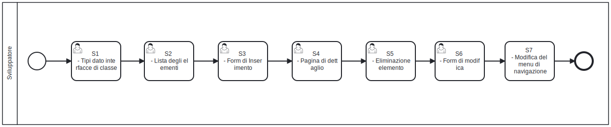

# Creare un'applicazione CRUD
E' utile illustrare il processo di implementazione di un'applicazione di tipo CRUD per evidenziare alcuni aspetti importanti durante l'implementazione come:

* L'organizzazione dei file e delle cartelle per un nuovo modulo;
* La localizzazione linguistica dei messaggi, delle etichette e dei nomi dei campi;
* Il caching delle componenti;
* Il render client-side e server-side delle componenti;
* L'accesso alla base dati con l'ORM.

## Workflow implementazione di un nuovo modulo

Il modo più efficiente per avviare lo sviluppo di un nuovo modulo software in SOUL consiste nell'implementazione iniziale delle interfacce di classe e dei tipi dato trattati dal nuovo modulo. La creazione della pagina di elenco degli elementi, consente di definire la struttura di base del modulo e di facilitare l'integrazione con le funzionalità successive.

Particolare attenzione deve essere riservata alla progettazione del form di inserimento, che rappresenta il punto in cui si concentra la maggior parte del tempo di sviluppo. È infatti essenziale curare l’esperienza utente, garantendo un’interazione fluida e un buon livello di usabilità.

Una volta completata la logica di inserimento, si può procedere con la realizzazione della pagina di dettaglio dell’elemento, che solitamente eredita parte delle strutture già definite.

Per quanto riguarda l’eliminazione di un elemento, è fondamentale che sia sempre accompagnata da un messaggio di conferma, al fine di evitare cancellazioni accidentali.

Infine, la form di modifica viene di norma sviluppata partendo da una copia di quella di inserimento, adattandola alle specifiche esigenze di aggiornamento del dato.

Per accedere ad ogni interfaccia utente è necessario realizzare un nuova rotta secondo quanto definito dalle [linee guida per la crezione di una pagina NextJS](https://nextjs.org/docs/app/getting-started/layouts-and-pages). La progettazione e il disegno di ogni interfaccia utente, è accompagnata dalla creazione di nuove [server actions NextJS che recuparano i dati dal database](https://nextjs.org/docs/app/building-your-application/data-fetching/server-actions-and-mutations).



Un nuovo modulo CRUD prevede la creazione di nuovi componenti e rotte NextJS, con forma e struttura presentate nelle [linee guida per la scrittura del codice](/stile-codice). E' importante sottolineare che attenersi alle linee guida di scrittura del codice è fondamentale nello sviluppo di applicazioni SOUL (NextJS). Uno degli obiettivi principali dello stile di sviluppo adottato è minimizzare il numero di interazioni necessarie tra utente e sistema, ottimizzando così l’esperienza utente e le prestazioni complessive. In particolare, è essenziale **limitare le richieste al server** esclusivamente nei **momenti in cui l’utente ha bisogno di nuovi dati**, evitando richieste superflue. Quando possibile, è buona pratica restituire più dati in un’unica risposta per massimizzare il throughput lato server. Inoltre, durante il **primo caricamento della pagina** (server-side), è importante **prelevare il maggior numero di informazioni utili**, in modo da ridurre al minimo le successive interazioni con il backend e, di conseguenza, il carico complessivo sul sistema.

# Esempio di implementazione di un nuovo modulo

L'esempio di creazione del nuovo modulo CRUD viene fatta a partire dalla modellazione dei dati già presentata alla sezione [esempio di modellazione della base dati](/orm#esempio-di-modellazione) . Il nuovo modulo dell'applicativo tratterà una domanda di prenotazione di un mezzo. La nuova domanda di prenotazione di risorsa presentata da un utente conterrà: l' indirizzo email dell'utente; la tipologia di risorsa che deve essere prenotata  (auto, bicicletta, monopattino), il tempo di utilizzo della risorsa.

## Tipi e interfacce di classe

Le interfacce di classe e i tipi dato sono necessari a migliorare la leggibilità del codice. L'esperienza di sviluppo è migliorata per gli IDE di nuova generazione dotati di analizzatori di codice statico e di meccanismi di autosuggerimento.

```typescript
// nextjs/types/request.ts

import { resourceType } from "@prisma/client";

export default interface Request {
  id: number;
  createdBy: String;
  resourceType: resourceType;
  bookingDate: Date;
  bookingSlot?:  String;
  createdAt: Date;
  updatedAt: Date;
}
```

## Lista degli elementi ed eliminazione di un elemento

La nuova pagina che presenta l'interfaccia web all'utente che elenca le **richieste di prenotazione inoltrate dall'utente finale**, sarà raggiungibile all'indirizzo */secure/request/my/*. Per creare la nuova rotta va creato un nuovo **React Server Component** nella posizione *nextjs/app/secure/request/my/page.tsx*

```jsx
// nextjs/app/secure/request/page.tsx

"use server";

import { permissionType } from "@prisma/client";
import { isAuthorized } from "@/components/common/utils";
import MyRequests from "@/components/request/my-requests";
// ...

export default async function Page() {
  const user = await getSessionPayload();
  // ...
  return (
    <>
    	<!-- <meta /> ... -->
      {!isAuthorized(user, permissionType.requestRead) ? (
          <UserNotAuthorized />
        ) : (
          <!-- 
            Linee guida di scrittura del codice: 
            Tutti i dati sono caricati lato server 
            per massimizzare il numero di informazioni 
            resituite durante primo caricamento. 
            In questo momento è possibile usare
            Promise.all([...]) lato server, 
            per sfruttare la capacità di recuperare 
            dati in modo "simultaneo"... 
          -->
          <MyRequests requests={myRequests()} / >
        )}
    </>
  );
}
```

Deve essere creata poi la server action che recupera le richieste di prenotazione dal database. 

```jsx
// nextjs/components/request/actions.ts

"use server";

import Request from "@/types/request";
// ...

const prisma = Global.prisma.client;

export async function myRequests(): Promise<Request[]> {
  // ...
}

export async function deleteRequest(id: any): Promise<boolean> {
  // ...
}

```

Segue la modellazione dell'interfaccia utente che presenta l'elenco delle richieste all'utente finale.

```jsx
// nextjs/components/request/my-requests.ts

"use client";

import Request from "@/types/request";
import { deleteRequest } from "@/components/request/actions";
// ...

type MyRequestsProps = {
  requests: Request[];
};

export default function MyRequests({ requests }: MyRequestsProps) {
  
  // Visualizza messaggio di conferma e notifica 
  // esito dell'operazione
  const removeRequest = async (id: number, e: any) => {
    // ...
    const response = await deleteRequest(id);
  };

  return (
    <section className={"mt-3"}>
			<!-- 
				Ogni elemento è accompagnato da 
				un pulsante di cancellazione e modifica ... 
			-->
    </section>);
}
```

## Form di inserimento

La pagina che consente all' **utente finale** di presentare nuove richieste di prenotazione sarà raggiungibile all'indirizzo */secure/request/new/*. Per creare la nuova rotta, va creato un nuovo **React Server Component** nella posizione *nextjs/app/secure/request/new/page.tsx*

```jsx
// nextjs/app/secure/request/new/page.tsx
"use server";

import { permissionType } from "@prisma/client";
import { isAuthorized } from "@/components/common/utils";
import NewRequest from "@/components/request/new";
// ...

export default async function Page() {
  const user = await getSessionPayload();
	// ...
  return (
    <>
    	<!-- <meta /> ... -->
      {!isAuthorized(user, permissionType.requestCreate) ? (
          <UserNotAuthorized />
        ) : (
          <NewRequest / >
        )}
    </>
  );
}
```

Deve essere creata poi la server action che salva la nuova richiesta di prenotazione nel database. 

```jsx
// nextjs/components/request/actions.ts
"use server";

import Request from "@/types/request";
// ...

const prisma = Global.prisma.client;

// ... myRequests, deleteRequests

/*** 
	In fase di creazione la richiesta non ha tutti
	gli attributi richiesti dall'interfaccia 
	Request (nextjs/types/request.ts). 
	Usando Partial<Request> 
	possiamo decidere di riportare solo 
  gli attributi necessari per l'operazione di inserimento, 
  completando gli attributi mancanti 
  che possono o devono essere recuperati 
  lato server 
  (eg. createdBy: mail dell'utente autenticato) 
*/
export async function createRequest(request: Partial<Request>): Promise<Request> {
  // ...
}

// Se la domanda è stato inserita vai alla pagina di dettaglio
export async function createRequestAndGotoDetail(data: Partial<Request>): void {
  // ...
  const request = await createRequest(data);
  const url = request ? `/request/${request.id}` : "/request/new";
  redirect(url);
}

```

Segue la modellazione dell'interfaccia utente che presenta la form per presentare una nuova richiesta di prenotazione risorsa. Per i componenti di input della form, la [libreria React Mui](https://mui.com) mette a disposizione tutte le componenti di input previste dal [Material Design](https://en.wikipedia.org/wiki/Material_Design).

```jsx
// nextjs/components/request/new.tsx

"use client";

import Box from "@mui/material/Box";
import FormControl from "@mui/material/FormControl";
import FormHelperText from "@mui/material/FormHelperText";
import Input from "@mui/material/Input";
import Button from "@mui/material/Button";
// ...

type NewProps = {};

export default function NewRequest({  }: NewProps) {
  
  const [valid, setValid] = useState(false);
  const [bookingDate, setBookingDate] = useState({ valid: true, value: null });
  // ...
  
  return (
    <>
    	<Box
          onReset={
        		// handle on reset
      		}
          onChange={() => {
            setValid(
            	// ...
            );
          }}
          onSubmit={
        		// handle on submit
     	 		}
          component="form"
          noValidate
        >
      
          <FormControl ...
            error={!bookingDate.valid}
            >
            <InputLabel htmlFor="bookingDate">{t`Booking date`}</InputLabel>
            <Input 
              value={bookingDate.value}
              error={!bookingDate.valid}
              onChange={(e) => {
								// Qui puoi controllare la validità dell'input
                setBookingDate({
                  valid: e.target.validity.valid,
                  value: e.target.value
                });
              }}

              ... />
            <FormHelperText >
              <!-- ... -->
            </FormHelperText>
          </FormControl>

          <!-- ... -->
      
          <div className="mt-3 px-2">
            <!-- Reset button, Submit button -->
          </div>
      
			</Box>
    </>
  );
}
```

## Pagina di dettaglio

Quando l'operazione di creazione di una nuova domanda di prenotazione risorsa termina con successo, l'utente viene rimandato alla **pagina di dettaglio della nuova richiesta**.  La pagina che consente all' **utente finale** di visualizzare i dettagli della prenotazione sarà raggiungibile all'indirizzo */secure/request/[id]/detail/*. Per creare la nuova rotta, va creato un nuovo **React Server Component** nella posizione *nextjs/app/secure/request/[id]/detail/page.tsx*

```jsx
// nextjs/app/secure/request/[id]/detail/page.tsx
"use server";

import { permissionType } from "@prisma/client";
import { isAuthorized } from "@/components/common/utils";
import RequestDetail from "@/components/request/detail";
import { findById } from "@/components/request/actions";
// ...

export default async function Page({
  params,
}: {
  params: Promise<{ id: string }>;
}) {
  const user = await getSessionPayload();
  const id = (await params).id;
  let request = null;
  try {
    request = await findById(parseInt(id));
  } catch (e) {
    // pass
  }
	// ...
  return (
    <>
      {!isAuthorized(user, permissionType.requestRead) ? (
        <UserNotAuthorized />
      ) : request ? (
        <RequestDetail request={request} />
      ) : (
        <NotFound />
      )}
    </>
  );
}
```

Deve essere creata poi la server action che trova la richiesta di prenotazione nel database. 

```jsx
// nextjs/components/request/actions.ts
"use server";

import Request from "@/types/request";
// ...

const prisma = Global.prisma.client;

// ... myRequests, deleteRequests, 
// createRequest, createRequestAndGotoDetail
export async function findById(id: number): Promise<Request> {
  // ...
}
```

Segue la modellazione dell'interfaccia utente che presenta i dettagli della richiesta all'utente finale.

```jsx
// nextjs/components/request/detail.tsx

"use client";

import Request from "@/types/request";
// ...

type DetailProps = {
  request: Request
};

export default function RequestDetail({  }: DetailProps) {
  
  // ...
  
  return (
    <!-- Dettagli richiesta ... -->
    <div className="mt-3 px-2">
      <!-- MyRequests button, Update button -->
    </div>
  );
}
```

## Form di modifica

La pagina che consente all' **utente finale** di modificare le richieste di prenotazione presentate, sarà raggiungibile all'indirizzo */secure/request/[id]]/update/*. Per creare la nuova rotta, va creato un nuovo **React Server Component** nella posizione *nextjs/app/secure/request/[id]]/update/page.tsx*

```jsx
// nextjs/app/secure/request/[id]/update/page.tsx
"use server";

import { permissionType } from "@prisma/client";
import { isAuthorized } from "@/components/common/utils";
import UpdateRequest from "@/components/request/update";
// ...

export default async function Page({
  params,
}: {
  params: Promise<{ id: string }>;
}) {
  const user = await getSessionPayload();
  const id = (await params).id;
  let request = null;
  try {
    request = await findById(parseInt(id));
  } catch (e) {
    // pass
  }
	// ...
  return (
    <>
      {!isAuthorized(user, permissionType.requestUpdate) ? (
        <UserNotAuthorized />
      ) : request ? (
        <UpdateRequest request={request} />
      ) : (
        <NotFound />
      )}
    </>
  );
}
```

Deve essere creata poi la server action che modifica una richiesta di prenotazione nel database. 

```jsx
// nextjs/components/request/actions.ts
"use server";

import Request from "@/types/request";
// ...

const prisma = Global.prisma.client;

// ... myRequests, deleteRequests, 
// createRequest, createRequestAndGotoDetail, findById
export async function updateRequest(request: Request): Promise<Request> {
  // ...
}
```

Segue la modellazione dell'interfaccia utente che presenta la form per modificare una richiesta di prenotazione risorsa. Per i componenti di input della form, la [libreria React Mui](https://mui.com) mette a disposizione tutte le componenti di input previste dal [Material Design](https://en.wikipedia.org/wiki/Material_Design).

```jsx
// nextjs/components/request/update.tsx

"use client";

import Request from "@/types/request";
// ...

// Una richiesta ha sempre un id
type UpdateProps = {
  request: Request
};

export default function UpdateRequest({ request }: UpdateProps) {
  
  // ...
  
  return (
    <>
    	<!-- 
				Simile alla form di inserimento, 
				ma presenta notifica sull'esito
 				dell'operazione ... 
			-->
    </>
  );
}
```

