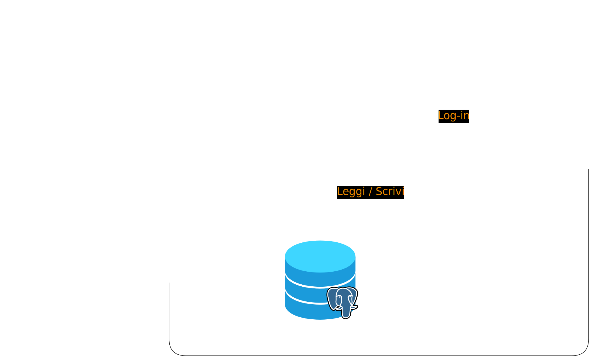
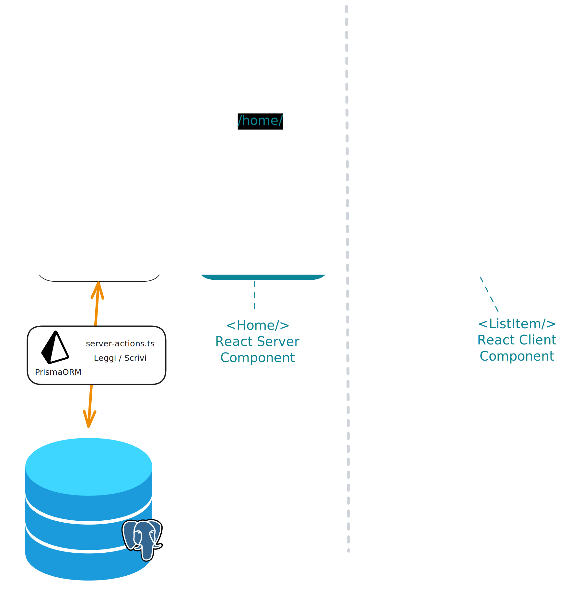
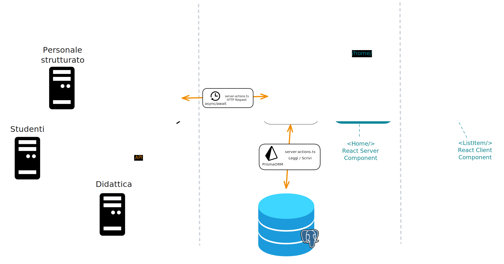

# Architettura dei sistemi

Le applicazioni SOUL hanno un stile architetturale a **microservizi** e sono realizzate con i container Docker.  Le applicazioni SOUL devono essere progettate per il dispiegamento in ambienti cloud moderni che adottano modelli PaaS (Platform as a Service) e infrastrutture effimere, ovvero temporanee e ricreate a ogni deploy. Questo approccio semplifica l'integrazione continua (CI) e la distribuzione continua (CD) negli ambienti di staging e produzione.

Le applicazioni SOUL create a partire dallo [Starter Kit](https://github.com/Piattaforme-Applicativi/soul-starter-kit) prevedono l'impiego di quattro container:

* **SimpleSAMLphp** -  Un Identity Provider SAML 2.0 per simulare l'autenticazione degli utenti nell'ambiente di sviluppo;
* **NextJS** - Applicazione web per l'interazione con l'utente finale;
* **PostgreSQL** - Database relazionale per la persistenza dei dati;
* **Cronjob** - Sistema batch per il download programmato dei dati da fonti esterne (opzionale).

## NextJS

Gli applicativi SOUL hanno l'obbiettivo di gestire l'interazione con l'utente. In questo tipo di progetti lo sviluppatore spende molto tempo nella modellazione delle interfacce utente.  NextJS è il microservizio nel quale lo sviluppatore dopo aver studiato e progettato l'interazione l'utente, costruisce le interfacce grafiche. NextJS, in configurazione [App Router](https://nextjs.org/docs/app), ha uno stile architetturale **monolitico**, ovvero con un minor disaccoppiamento tra UI e business logic al fine di semplificare l'attività di sviluppo. Questo approccio è particolarmente indicato per progetti che presentano le seguenti caratteristiche:

- MVP (Minimum Viable Product), prototipi o app sviluppate da team di piccole dimensioni;
- Progetti interni, CRUD semplici, gestionali;
- Progetti per i quali serve velocità di sviluppo e facilità di deploy;
- Se il dominio non è ancora ben definito (adottando l'architettura monolitica, non è necessario prevedere e implementare forme di astrazione per accettare nuovi cambiamenti).

Gli applicativi web sviluppati con il framework NextJS versione 16 (App Router), permettono di costruire applicativi con design pattern architetturale di tipo **client-server e multi tier**. 

Il framework eredita le funzionalità di React, pertanto è possibile utilizzare i componenti React lato client e lato server. Gli applicativi web sviluppati con questa tecnologia sono di tipo client-server e prevedono che l'utente interagisca con l'applicazione dispiegata nel server Node/NextJS attraverso il browser.

### Architettura standard a due livelli

L'archittettura standard di un'applicazione SOUL è organizzata a **due livelli**:

* Nel **primo livello** sono gestite: le richieste che l'utente invia al server; la presentazione del codice HTML restituito dal sever; le operazioni che modificano l'interfaccia utente lato client (browser);
* Nel **secondo livello** sono gestite: l'esecuzione del codice Javascript lato server; la logica di presentazione e la logica di business; la comunicazione con il database attraverso un ORM.

### Architettura a tre livelli

Al fine di perseguire qualità del prodotto finale quali affidabilità, efficienza delle prestazioni, manutenibilità e sicurezza, il sistema prevede l'utilizzo di un container che ha il compito di sincronizzare i dati condivisi dall'Ateneo nella banca dati "locale". Il sistema può tuttavia essere modificato per consumare sorgenti dati esterne in modalità "quasi tempo reale" (semi real-time). A seguire riportiamo alcuni scenari in cui questo tipo di strategia risulta vantaggiosa:

* L'applicazione non può sincronizzare localmente i dati del sistema "terzo" a causa della loro **dimensione/volume**;
* L'applicazione richiede il **dato "fresco"**, ovvero l'informazione appena aggiornata;
* Il sistema esterno **non permette la copia "locale"** dei dati.

In questi casi è necessario prevedere un'architettura a tre livelli. Il terzo livello ha il compito di fornire accesso alle risorse esterne via API o preferibilemente via API Gateway.

