# Autenticazione e autorizzazione

Lo Starter Kit è progettato secondo i principi di [Privacy by Design](/policy). In aderenza all'Art. 5(1)(c), implementa la minimizzazione dei dati, limitando la raccolta al solo indispensabile per l’erogazione del servizio. La sicurezza è garantita da protocolli di pseudonimizzazione (Art. 4(5)), che isolano e segregano i dati utente dagli archivi operativi.

Il sistema di autenticazione dello Starter Kit è progettato in conformità con le linee guida ufficiali fornite da **NextJS**, seguendo le buone pratiche riportate nella documentazione alla voce [`Guide > Autentication`](https://nextjs.org/docs/pages/guides/authentication). In particolare, per garantire la sicurezza e l'interoperabilità dei sistemi, l'infrastruttura prevede l'integrazione con il **Single Sign-On (SSO) di Ateneo**, quale meccanismo centrale per la gestione delle identità e in parte delle sessioni utente. L'integrazione viene attivata al momento del rilascio delle nuove applicazioni in ambienti differenti da quello di sviluppo, assicurando così che tutte le nuove istanze dell'applicazione siano vincolate al sistema di autenticazione istituzionale. E' prevista una procedura formale di accreditamento del nuovo sistema presso il team che gestisce l'Identity Provider SAML (da ora IdP). La registrazione è necessaria per completare il processo di integrazione dei nuovi applicativi. Nel linguaggio SAML, le nuove applicazioni vengono chiamate  Service Provider (da ora SP). Per agevolare le attività di sviluppo e test, l'ambiente di sviluppo di SOUL mette a disposizione un **IdP simulato**, che consente di collaudare il comportamento del sistema di autenticazione posticipando l'integrazione con l'IdP ufficiale. Questo approccio consente ai team di sviluppo di lavorare in modo autonomo e flessibile, garantendo al contempo compatibilità in fase di rilascio.

## Identità dell'utente e gestione della sessione

Le applicazioni sviluppate con SOUL devono utilizzare l'IdP di Ateneo.  Il flusso di autenticazione e autorizzazione si  articola in più fasi, orchestrate tra applicazione lato client (Browser), applicazione lato server Next.js (SP) e server che contiene le identità degli utenti (IdP). Autenticazione e autorizzazione in SOUL si declinano rispetto alle [linee guida di autenticazione di NextJS](https://nextjs.org/docs/pages/guides/authentication#stateless-sessions) come segue:

* **Authentication**: la verifica dell'identità dell'utente è demandata all'IdP di Ateneo;
* **Session management**: è **stateless**. I dati della sessione e l'identità dell'utente sono salvati in un cookie. Mantenere la sessione stateless è conveniente in caso di dispiegamento negli ambienti cloud di Ateneo (ovvero con architettura PaaS e contenitori immutabili );
* **Authorization**: l'autorizzazione è di tipo **secure**. In ogni pagina dell'applicazione vengono eseguiti dei controlli sulla base dei permessi memorizzati nella sessione utente. Il cookie di sessione contiene l'elenco dei permessi dell'utente autenticato. A partire da questi permessi, è possibile implementare controlli mirati nelle pagine che necessitano di autorizzazione (React Server Components) .

Per entrare nel dettaglio del **flusso di autenticazione**, quando un utente tenta di accedere ad una rotta protetta (es. `/secure/request`), viene reindirizzato all’IdP per effettuare il login. L’IdP verifica le credenziali dell’utente e restituisce un token SAML 2.0 cifrato. Le informazioni estratte dal token SAML vengono decifrate. Gli attributi di identità dell'utente vengono memorizzati in una cache lato server. L'attributo identificativo dell'utente viene offuscato e convertito in un token Paseto che include anche i relativi ruoli e permessi. Il Paseto token aiuta a trasportare i dati di sessione in modo sicuro e compatto. Il Paseto token viene cifrato e memorizzato in un cookie di sessione, con gli attributi `HttpOnly`, `Secure` e `SameSite` per mitigare rischi come XSS e CSRF.

A ogni richiesta verso una rotta protetta, il middleware lato server di Next.js `proxy.ts` intercetta la richiesta, estrae il Paseto token  dal cookie e tenta di decifrarlo. Se il token viene decifrato con successo, il middleware consente l’accesso alla  risorsa. Quando non è possibile decifrare il token, l’utente viene  reindirizzato ad una pagina di errore o al login. Lato client il cookie di sessione non può essere manipolato via Javascript (`HttpOnly`) . Le informazioni utente possono essere recuperate unicamente lato server. Le informazioni conservate nel token consentono di personalizzare l'interfaccia utente utilizzando i permessi.

Il riconoscimento dell'utente è delegato all'IdP. L’uso di cookie di sessione è prerequisito per un’architettura stateless, scalabile e facilmente integrabile con altri servizi (sopratutto con infrastrutture basate su container di tipo effimero). L’intero  flusso è compatibile con lo standard SAML e può essere esteso per supportare OAuth2 o OpenID Connect. Questo modello è  particolarmente adatto per applicazioni moderne che richiedono  sicurezza, modularità e interoperabilità con sistemi di identità aziendali.


### Tipi di identità restituite dall'IdP

Il processo di autenticazione SSO all’Università degli Studi di Padova si basa su un IdP conforme a SAML 2.0. A seguito dell'autenticazione l'IdP di Ateneo fornisce gli attributi dell'utente. Gli utenti possono essere **interni**  (studenti, alunni, dipendenti, collaboratori esterni) oppure **esterni** (autenticati tramite: SPID; CIE; IDEM). 

Gli utenti interni si autenticano all’IdP locale e ricevono un insieme di attributi che includono: identificatori (`shib_extid`, `shib_id`); codice fiscale (`shib_codicefiscale`); nome e cognome (`shib_givenname`, `shib_sn`); l’indirizzo email (`shib_mail`). L'affiliazione all'Ateneo (`shib_edupersonscopedaffiliation`)  è opzionale e multivalore. L'affiliazione all'Ateneo può assumere uno o più valori dell'insieme `[ 'member@unipd.it', 'staff@unipd.it', 'alum@unipd.it' ]`.  

L'IdP comunica per il personale strutturato dell'Ateneo (`STAFF`) gli attributi: codice sede lavorativa (`shib_codsedeserviziodip`); nome esteso della sede lavorativa (`shib_sedeserviziodip`).

Gli attributi `shib_mail`e `shib_id` hanno come valore l'indirizzo email dell'utente autenticato. Per distinguere tra studenti e dipendenti, è necessario analizzare il  dominio dell’indirizzo email: gli studenti hanno email che terminano con `@studenti.unipd.it`, mentre i dipendenti usano `@unipd.it`. Questo permette di classificare correttamente l’utente e applicare le relative regole di accesso.

Gli utenti esterni si autenticano tramite sistemi federati con l'Ateneo come: SPID; CIE; Idem. In questi casi, l’IdP del sistema federato trasmette il set di attributi dell'utente autenticato. 
Per fare un esempio, nel caso di federazione con SPID, l'IdP SPID include: il codice identificativo SPID (`spid_spidCode`); il codice fiscale (`spid_fiscalNumber`); un eventuale codice IVA (`spid_ivaCode`); l’indirizzo email (`spid_email`). L’attributo `shib_authsource` assume il valore `SPID`. L'IdP tenta di aggiungere gli attributi del profilo utente di Ateneo, quando riconosce che il codice fiscale (`shib_codicefiscale`) trasmesso via SPID/CIE è presente nelle banche dati di Unipd (eg. PTA che accede come cittadino).

Alcune regole per classificare le diverse tipologie di utente:

* **Studenti che frequentano** e **personale**: sono considerati affiliati all'Ateneo; hanno una casella di posta @unipd.it oppure @studenti.unipd.it;
* Quando gli **alumni** non fanno più parte dell'organizzazione non hanno più diritto al **servizio di posta**, tuttavia conservano l'accesso con il loro account (nome.cognome@studenti.unipd.it);
* I collaboratori esterni hanno una casella mail che ha indirizzo nome.cognome@unipd.it ma non hanno affiliazione con l'organizzazione Ateneo.



Segue il riferimento agli attributi restituiti dall'IdP via protocollo SAML per realizzare l'autenticazione. 

```xml
<!--
	Questo file è stato adattato a partire dal file attribute-map.xml.
	Per avere l'elenco completo degli attributi presenti nel file attribute-map.xml
 	e messi a disposizione dall'IdP, va fatta richiesta al team che gestisce l'IdP.
-->

<Attributes xmlns="urn:mace:shibboleth:2.0:attribute-map" xmlns:xsi="http://www.w3.org/2001/XMLSchema-instance">
    <!-- c'è sempre per utenze interne e IDEM, non per SPID/CIE -->
    <Attribute name="urn:oid:2.5.4.42" id="shib_givenname"/> <!-- SOUL: firstName -->
		<!-- .... -->
    <Attribute name="urn:oid:2.5.4.4" id="shib_sn"/> <!-- SOUL: familyName -->
    <!-- .... -->
    <!-- c'è sempre per utenze interne e IDEM, non per SPID/CIE -->
    <Attribute name="urn:oid:0.9.2342.19200300.100.1.3" id="shib_mail"/> <!-- SOUL: mail, SOUL: id -->
  	<!-- .... -->
    <!-- descrive il rapporto (affiliazione) di una persona con un’istituzione, “scopato” da un dominio (cioè legato a un dominio dell’organizzazione). 
		Esempio di valore ritornato: 'member@unipd.it', 'staff@unipd.it', 'alum@unipd.it'

		La parte prima della @ (es. member, alum, staff) indica il tipo di affiliazione.
		La parte dopo la @ (es. unipd.it) indica il dominio dell’organizzazione.
		-->
    <Attribute name="urn:oid:1.3.6.1.4.1.5923.1.1.1.9" id="shib_edupersonscopedaffiliation"/> 
    <!-- .... -->
  	<Attribute name="https://www.cca.unipd.it/sso/attributes/codicefiscale" id="shib_codicefiscale"/> <!-- SOUL: codiceFiscale -->
  	<!-- .... -->
  	<Attribute name="www.cca.unipd.it/sso/attributes/externalid" id="shib_extid"/>   <!-- SOUL: externalId -->
  	<!-- .... -->
  
    <Attribute name="www.cca.unipd.it/sso/attributes/codsedeserviziodip" id="shib_codsedeserviziodip"/>   <!-- SOUL: workplace.code -->
    <Attribute name="www.cca.unipd.it/sso/attributes/sedeserviziodip" id="shib_sedeserviziodip"/>   <!-- SOUL: workplace.description -->
  <!-- .... -->
  
  <!-- shib_id: evitarne l'uso se possibile, perche' dipende dal metodo di autenticazione: nel tempo può cambiare -->
    <Attribute name="https://www.cca.unipd.it/shib_id" id="shib_id"/>
  	<!-- .... -->
  
    <!-- shib_authsource: CIE | SPID, può essere vuoto quando si tratta di identità locale -->
    <Attribute name="https://www.cca.unipd.it/sso/attributes/authSource" id="shib_authsource"/>
  
 </Attributes>
```

Segue un esempio di pseudo codice per riconoscere e classificare le diverse tipologie di utente dopo l'autenticazione

```
INIZIO

  FUNZIONE estrai_dominio(email = NON DEFINITO, id = NON DEFINITO)

      // Se entrambi email e id non sono definiti, ritorna NON DEFINITO
      SE email E' NON DEFINITO E id E' NON DEFINITO ALLORA
          RITORNA NON DEFINITO
      FINE SE

      // Se email non definito, usa id
      DICHIARA mail = SE email E' NON DEFINITO ALLORA id ALTRIMENTI email

      // Trova la posizione del simbolo '@'
      DICHIARA posizione_arroba = TROVA_POSIZIONE(mail, "@")

      // Se non c'è '@', ritorna NON DEFINITO
      SE posizione_arroba = NON TROVATO ALLORA
          RITORNA NON DEFINITO
      FINE SE

      // Estrai la parte dopo '@'
      DICHIARA dominio = SOTTOSTRINGA(mail, posizione_arroba + 1, FINE)

      RITORNA dominio

  FINE FUNZIONE


  FUNZIONE tipo_utente(mail = NON DEFINITO, id = NON DEFINITO, tipo_utente = NON DEFINITO, sorgente = NON DEFINITO)

      // Se l'utente non compare tra gli utenti dell'Ateneo può essere una federazione SPID o CIE
      SE sorgente E' UGUALE a "CIE" ALLORA
          RITORNA CIE
      FINE SE
      
      SE sorgente E' UGUALE a "SPID" ALLORA
          RITORNA SPID
      FINE SE

      // Se non conosco il dominio di provenienza dell'utente non posso dire nulla
      DICHIARA dominio = estrai_dominio(mail, id)
      SE dominio E' NON DEFINITO ALLORA
          RITORNA NON DEFINITO
      FINE SE

      // Se il dominio è studenti.unipd.it
      SE dominio E' UGUALE A 'studenti.unipd.it' E 'alum@unipd.it' E' IN tipo_utente ALLORA
          SE mail E' NON DEFINITO ALLORA
              RITORNA ALUMNI
          ALTRIMENTI
              RITORNA STUDENT
          FINE SE

      // Se il dominio è unipd.it
      ALTRIMENTI SE dominio E' UGUALE A 'unipd.it' ALLORA
          SE tipo_utente E' NON DEFINITO ALLORA
              RITORNA EXTERNAL
          ALTRIMENTI SE 'staff@unipd.it' E' IN tipo_utente ALLORA
              RITORNA STAFF
          FINE SE
      FINE SE

      // Se nessuna condizione è soddisfatta
      RITORNA NON DEFINITO

  FINE FUNZIONE

FINE

```

## Workflow di integrazione

Per integrare correttamente il sistema è necessario creare un nuovo file `.env`, che contiene le configurazioni essenziali. Le principali chiavi da configurare sono:

- **SSO_PROVIDER**, ovvero l'IdP al quale deve essere registrato l'SP. La registrazione può avvenire per diversi ambienti (`local` = Mockup, `unipd_test` = Unipd di Test,  `unipd` = Unipd di Produzione );
- **SSO_SP_ENTITY_ID**, che rappresenta l'identificativo con cui registrare l'SP presso l'IdP. Per convenzione, questo valore corrisponde al `BASE_URL`;
- **BASE_URL**, ossia l'indirizzo completo (incluso protocollo e dominio) tramite il quale l'applicativo sarà raggiungibile dal browser (eg. `https://booking-requests.ict.unipd.it`);
- **SP_PRIVATE_KEY** e **SP_CERT_KEY**, che sono le chiavi necessarie per garantire una comunicazione sicura tra Browser, SP e IdP.

All'interno dello [Starter Kit](https://github.com/Piattaforme-Applicativi/soul-starter-kit) è disponibile un'interfaccia utente che semplifica la generazione del file di configurazione. L'interfaccia utente è raggiungibile nell'applicazione al path `/configuration/new`.

Dopo aver creato correttamente il file `.env`, si può procedere con il dispiegamento del sistema sia in ambiente di staging che in produzione. Una volta che il sistema è operativo e raggiungibile tramite l'indirizzo configurato in `BASE_URL`, è possibile scaricare il file di metadata che identifica l'SP accedendo al path `/saml/metadata`.

A questo punto, con il file di metadata disponibile, è possibile completare la registrazione del nuovo SP presso l'IdP di Ateneo. Prima di accedere alla [pagina di richiesta di accreditamento Single Sign On di Ateneo](https://registrazionisp.ict.unipd.it/form/richiestesso), è necessario ricevere un nuovo codice di invito (**Invitation Code**) scrivendo alla [coda ticket di Ateneo](https://helpdesk.ammcentr.unipd.it/otrs/customer.pl?OTRSCustomerInterface=oBbwZal2mXfTD3xE9GABt7nCH0MNaaPD).


Un possibile messaggio per chiedere l'Invitation Code nella coda ticket _Single Sign On potrebbe essere:

> Buongiorno,
>
> stò completando l'attività di integrazione dell'ambiente staging per il nuovo
> sistema "xxx" con l'Identity Provider SAML di Ateneo.
>
> Potreste gentilmente comunicarmi l'Invitation Code per completare la domanda nel form "Richieste accreditamento Single Sign-On di Ateneo - UniPD"

### Compiti dello sviluppatore

Segue l'elenco delle attività che lo sviluppatore deve portare a termine per integrare i nuovi applicativi con l'IdP di Ateneo.

| Codice | Nome del compito                              | Descrizione del compito                                      |
| :----: | --------------------------------------------- | ------------------------------------------------------------ |
|   S1   | Preparazione al rilascio staging o produzione | Lo sviluppatore crea un nuovo file  `.env`  per gli ambienti di produzione o di staging. Lo sviluppatore può rilasciare il nuovo applicativo negli ambienti di staging o di produzione. **ATTENZIONE**: Completato il compito il sistema sarà raggiungibile ma l'utente finale non potrà autenticarsi nel sistema. |
|   A1   | Nuovo ticket registrazione SP                 | Il personale ASIT richiede un **Invitation Code** per completare la richiesta di accreditamento Single Sign On di Ateneo nella **coda ticket _Single Sign On** dell'Ateneo. |
|   S3   | Registrazione nuovo SP                        | Lo sviluppatore scarica dal nuovo applicativo dispiegato in staging o produzione il file dalla rotta `/saml/metadata` che identifica l' applicativo come SP.  Lo sviluppatore in possesso di **Invitation Code** e del file XML che identifica il nuovo applicativo / SP, invia una nuova  richiesta di accreditamento. Infase di richiesta devono essere dichiarati gli attributi utente che l'IdP deve comunicare all'SP a seguito dell'autenticazzione dell'utente. |

#### S3 - Registrazione di un nuovo SP

Al momento dell'invio della [richiesta di accreditamento Single Sign On di Ateneo](https://registrazionisp.ict.unipd.it/form/richiestesso) è necessario porre attenzione a queste informazioni richieste nella form:

* **Invitation Code**: ottenuto al passo A1;
* **Metadata SP**: è il file XML che può essere scaricato dal path `/saml/metadata`  dell'istanza dell'applicazione;
* **Attributi richiesti**: sono gli attributi necessari a creare il JWT nel cookie di sessione. Gli attributi che devono essere obbligatoriamente richiesti sono: `shib_codicefiscale`,`shib_extid` , `shib_sn`, `shib_givenname`, `shib_mail`, `shib_edupersonscopedaffiliation`, `shib_codsedeserviziodip`, `shib_sedeserviziodip`;
* **Note eventuali**: deve essere utilizzato nel caso in cui è necessario abilitare l'autenticazione con il sistema nazionale di identità digitale italiano.

# Ruoli, permessi e dati dell'utente

Lo Starter Kit mette a disposizione `getSessionPayload()` per accedere a ruoli e permessi.  Per ragioni di sicurezza Il metodo può essere utilizzato solo lato server per recuperare ruoli e permessi. Il metodo ritorna un oggetto che risponde all'interfaccia **UserSession**. Gli attributi della sessione utente (**UserSession**) sono:

* **sub**: è l'identificatore univoco per l'utente autenticato, offuscato con HMAC. Per gli utenti registrati in Unipd è l'indirizzo email assegnato dall'Ateneo (nome.cognome@unipd.it oppure nome.cognome@studenti.unipd.it). Per i cittadino che ha fatto l'accesso con SPID e CIE è il codice fiscale (questo per gestire in casi nei quali il cittadino ha più profili SPID);
* **roles**: I ruoli dell'utente assegnati con il modulo ruoli e permessi dello Starter Kit;
* **permissions**: I permessi dell'utente assegnati con il modulo ruoli e permessi dello Starter Kit;

Il metodo `getPayload()` nei React Server Components e `const { user } = useContext(AuthContext)` nei React Client Components, viene utilizzato per accedere in maniera semplificata: agli attributi dell'utente, ai ruoli e ai permessi . I due metodi ritornano un dato che implementa il contratto dell'interfaccia `Payload` (`nextjs/types/session.ts`). Il Payload della sessione è la combinazione dei dati sessione (**UserSession**) e dell'identità dell'utente (**AuthUser**)

Segue le descrizione delle proprietà di **AuthUser**. Proprietà di base sono:

* **id**: coincide con UserSession.id;
* **firstName**: nome dell'utente (eg. Alessandro);
* **familyName**: cognome dell'utente (eg. Volta);
* **codiceFiscale**: codice fiscale dell'utente (eg. VLTLSN27C05C933E);
* **userType**: uno tra i tipi (STAFF: personale strutturato Unipd, EXTERNAL: collaboratore esterno all'organizzazione Unipd; STUDENT: studente che frequenta i corsi; ALUMNI: ex-studente; SIPID o CIE: cittadino autenticato con SPID o CIE);

Proprietà condizionali (variabili a seconda del tipo di utente autenticato):

* **authSource**: è presente solo se l'utente si è autenticato con SPID o CIE;
* **externalId**: è il codice utilizzato da Unipd per identificare un utente registrato nei sistemi di Ateneo (**STAFF**, **EXTERNAL**, **STUDENT**, **ALUMNI**);
* **mail**: è sempre presente, fatta eccezione per gli ex-studenti che hanno effettuato l'accesso con le credenziali fornite dall'Ateneo (**ALUMNI**);
* **affiliation**: è sempre presente per: **STUDENTI**, **ALUMNI** e **STAFF**;
* **workplace**: presente per lo **STAFF**, riporta le informazioni del gruppo di lavoro (di solito settore o ufficio) dell'utente (eg. code: DXXXX, description: Ufficio relazioni con il pubblico).

```typescript
export interface AuthUser {
  id: string; // (mail address (Unipd) | codice fiscale)
  firstName: string; // user first name (eg. Alessandro)
  familyName: string; // user family name (eg. Volta)
  codiceFiscale: string; // user codice fiscale
  userType: userType; // ( CIE | SPID | STAFF | STUDENT | ALUMNI | EXTERNAL )
  
  // Conditional fields (may not be present in all user types)
  authSource?: "SPID" | "CIE"; // if the user authenticated with SPID or CIE
  externalId?: string | null; // if the user authenticated with Unipd account
  mail?: string; // not present if the user type is ALUMNI
  affiliation?: string[]; // if the user type is in  ( STAFF | STUDENT | ALUMNI )
  workplace?: {
    code: string;
    description: string;
  }; // if the user type is in (STAFF)
}

```

# Esempio di utilizzo di identità e permessi 

I permessi e i ruoli utente sono utili in scenari nei quali è necessario limitare l'acesso ai dati all'utente che stà utilizzando il sistema. I dati all'identità dell'utente sono custoditi in sessione. La funzione `getSessionPayload()` ritorna i dati di sessione memorizzati nella rotta `/saml/post-response`, a seguito della verifica delle credenziali dell'utente nell'IdP. I dati di autorizzazione all'accesso (ruoles, permissions) sono memorizzati nel cookie di sessione e possono essere recuperati solo lato server.

```jsx
"use server";
// ....

import { UserSession } from "@/types/session";
import { getSessionPayload } from "@/components/user/actions";

// ....

// ....
const user: UserSession = await getSessionPayload();
// ....
```

I permessi vengono utilizzati per limitare l'accesso ai dati. I permessi vengono eriditati dal ruolo dell'utente. Ci sono due modi per verificare se l'utente è in possesso di un ruolo. Lato server la funzione `isAuthorized()` utilizza l'identità utente per verificare se un permesso è presente nel cookie di sessione.

```jsx
// nextjs/app/secure/request/page.tsx

"use server";

import { getSessionPayload } from "@/components/user/actions";
import { UserSession } from "@/types/session";
import { permissionType } from "@/prisma/client/enums";
import { isAuthorized } from "@/components/common/utils";
// ...

export default async function Page() {
  const user: UserSession | null = await getSessionPayload();
  // ...
  return (
    <>
      <!-- <meta /> ... -->
      {!isAuthorized(user, permissionType.REQUEST_READ) ? (
          <UserNotAuthorized />
        ) : (
          <MyRequests requests={myRequests()} / >
        )}
    </>
  );
}
```

Lato client  il metodo `isAuthorized()` è messo a disposizione dal componente `<AuthProvider/>`. In questo caso **non è necessario specificare il parametro utente**.

```jsx
"use client";

// ...
import React, { useContext } from "react";
import AuthContext from "@/components/context/auth-context";
import { permissionType } from "@/prisma/client/enums";
// ...

export default function RequestListItem(props: { request: Request }) {
  const { isAuthorized } = useContext(AuthContext);
	// ...
  return (<>
            <!--

            -->
            {isAuthorized(permissionType.REQUEST_LIST) && (
                   <li className="nav-item dropdown">
            <!--

            -->
    </>);
} 
```

Il metodo `getPayload()`è necessario accedere ai dati dell'utente. Uno scenario comune per l'utilizzo del metodo è l'invio di notifiche all'utente. La notifica all'utente è utile quando vogliamo rassicurare l'utente dell'esito di un'operazione utilizzando l'indirizzo email dell'utente (eg. esito del salvataggio di una richiesta/domanda inviata dall'utente).

```ts
"use server";

// ...
import { getPayload } from "@/components/user/actions";
import { Payload } from "@/types/session";
import { getI18nInstance } from "@/components/common/i18n/server";
import { t } from "@lingui/core/macro";

// ...

export async function notify(): Promise<boolean> {
  	const payload: Payload = await getPayload();
  	if(!payload.mail) {
      return Err(i18n._(t`Email is missing`));
    }
    const mailMessage: MailMessage = {
    from: Global.config.mailerFromAddress as string, // noreply.applicativi@unipd.it
    to: payload.mail,
    subject: i18n._(t`You request was accepted`)),
    message: i18n._(t`We are taking care of your request`)),
        };
  return sendEmail(mailMessage).then((result) => {
    return true;
  })
  .catch((error) => {
    console.error("Error sending email:", error);
    return false;
  });
}
```

