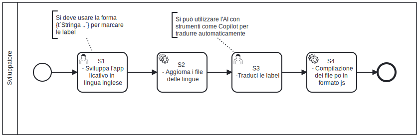

# Localizzazione linguistica
La **localizzazione linguistica** è il processo che consente a un'applicazione di supportare più lingue, adattando le interfacce utente e i contenuti testuali alla lingua dell'utente finale.

In SOUL, la localizzazione viene gestita come un'attività centralizzata e pianificata, da eseguire **in un'unica operazione** (approccio massivo) al termine dello sviluppo funzionale dell'applicazione. Questo consente di ottimizzare il processo, evitando interventi frammentati o parziali sulle traduzioni.

A supporto di questa attività, viene utilizzata la libreria **Lingui**, configurata per eseguire l'estrazione automatica delle stringhe da tradurre. L'estrazione avviene esclusivamente sui percorsi del filesystem specificati nel file di configurazione `lingui.config.js`, i quali devono includere solo i componenti e i moduli effettivamente soggetti a localizzazione.

Abbiamo verificato che l'utilizzo di strumenti basati su **Intelligenza Artificiale** per la traduzione automatica dei testi si rivela particolarmente efficiente. Questo approccio consente di accelerare significativamente i tempi, pur mantenendo la possibilità di un successivo affinamento manuale delle traduzioni ove necessario. Per questa ragione, rispettando le linee guida presentate di seguito è possibile posticipare l'attività di localizzaizone linguistica quando necessario.

Gli applicativi SOUL devono essere sviluppati preferibilmente in lingua inglese. Questa scelta è motivata da diversi vantaggi concreti:

- **Standard linguistico**: Nella comunicazione globale l'inglese è uno standard de facto. Nel caso in cui non abbiamo localizzato l'applicativo in lingua giapponese, c'è una buona probabilità che i giapponesi siano in grado di leggere un testo scritto in lingua inglese. In questo modo è possibile rimandare il processo di localizzazione, offrendo comunque un'interfaccia utente che anche se non è pensata per un target di utenza specifico è comunque comprensibile;
- **Compatibilità con team globali**: L'uso dell'inglese facilita la collaborazione tra sviluppatori e stakeholder di diverse nazionalità;
- **Riduzione degli errori di traduzione**: L'inglese consente una traduzione più precisa e affidabile, soprattutto su termini tecnici e specifici;
- **Facilità di espansione internazionale**: Partendo dall'inglese, è più semplice aggiungere ulteriori lingue al sistema in futuro;
- **Strumenti di traduzione automatica**: Nel caso delle AI, la maggior parte dei dati utilizzati per l'allenamento sono in inglese o tradotti dall'inglese, rendendo i modelli estremamente competenti su testi inglesi come lingua di partenza.

## Workflow di localizzazione linguistica

Ogni nuova funzionalità o componente deve essere sviluppato utilizzando **l'inglese come lingua base**, ma scrivendo tutte le label, i testi e i messaggi in **italiano**. 

Al termine dello sviluppo di una nuova funzionalità, lo sviluppatore deve eseguire il processo di estrazione delle label tramite la libreria **Lingui**. Questo processo aggiorna i file `.po`, che contengono le stringhe da tradurre, identificando nuove etichette e mantenendo la struttura delle traduzioni esistenti.

L'estrazione avviene analizzando solo i percorsi specificati nella configurazione `lingui.config.js`, garantendo che siano considerate esclusivamente le parti rilevanti del codice.

Una volta aggiornati i file `.po`, lo sviluppatore è responsabile della traduzione delle nuove label nella lingua di destinazione, che nel contesto attuale è l'**italiano**. Visto che la lingua dei messaggi di base è l'**italiano**, lo sviluppatore non è costretto a tradurre i messaggi in altre lingue se non deve presentare le interfacce utente ad una platea internazionale.

Le traduzioni devono essere accurate, rispettando il contesto applicativo e l'eventuale terminologia tecnica.

Per rendere operative le traduzioni all'interno dell'applicazione, le utility a linea di comando fornite da **Lingui** consentono di trasformare i file `.po` in file JavaScript ottimizzati, compatibili con il framework **Next.js**. Questo passaggio è essenziale per caricare dinamicamente i file di traduzione e garantire che l'applicazione risponda correttamente alle impostazioni linguistiche dell'utente.



## Compiti dello sviluppatore

Segue l'elenco delle attività che lo sviluppatore deve completare per localizzare il sistema. 

| Codice | Nome del compito                            | Descrizione del compito                                      |
| :----: | ------------------------------------------- | ------------------------------------------------------------ |
|   S1   | Scrive messaggi e label e testi in italiano | Lo sviluppatore marca tutte le label/stringhe che devono essere tradotte nell'applicativo con la macro ``{t`Stringa da tradurre`}``.  **Non utilizzare placeholder** di traduzione come ``{t`stringa_da _tradurre`}`` semplifica l'attività di localizzazione linguistica. |
|   S2   | Aggiorna il file delle lingue               | Lo sviluppatore aggiorna i file `.po` dove sono riportate le traduzioni delle stringhe/label. Le utility della libreria **Ligui** sono grado di estrarre automaticamente le label/stringhe elencate nei file dell'applicativo quando scritte nella forma  ``{t`Stringa da tradurre`}`` |
|   S3   | Compilazione delle traduzioni               | Lo sviluppatore compila i file `.po` dove sono riportate le traduzioni delle stringhe/label.  Le utility della libreria **Ligui** compilano i file in formato  `.po`  e producono file in formato  `.js` . A seguito della compilazione il sistema visualizza in tempo reale le traduzioni. |

# Esempio localizzazione linguistica

La libreria **Lingui** è configurata per individuare ed estrarre automaticamente le stringhe da tradurre esclusivamente all'interno di percorsi specifici del progetto. In particolare, il processo di localizzazione analizza solo le cartelle: **`nextjs/app`**, **`nextjs/types`** e **`nextjs/components`**.
 All'interno di queste directory si trovano i componenti, i file di tipo e le parti applicative che contengono le label e i testi soggetti a localizzazione. Questo approccio garantisce un'estrazione mirata, evitando di includere file o sezioni del progetto che non richiedono traduzioni.

Lo sviluppare crea le nuove componenti con le stringhe/label da tradurre.

```jsx
// ....
import { t } from "@lingui/macro";
// ...

export default function MyRequests({ requests }: MyRequestsProps) {
  return (
    <>
    	<!-- Le label vanno marcate utilizzando la macro lingui t``-->
    	<b>{t`Le mie richieste`}</b>
    	<!--  ...  -->
    </>);
}
```

Una volta aggiunte tutte le traduzione lo sviluppatore può utilizzare l'utility `lingui extract`e aggiornare  i file `.po`. Nel file `nextjs/package.json` è definito un comando nella forma abbreviata `lingui-extract`  per eseguire il comando nel container NextJS.

```bash
docker exec -it soul-nextjs npm run lingui-extract
```

A questo punto è possibile tradurre le stringhe/label nel file `translations/locales/en/messages.po`. I file di `.po` riportano messaggi e le loro traduzioni nella forma

```
#: components/role/new.tsx
#: components/role/update.tsx
msgid "Le mie richieste"
msgstr ""
```

Un volta tradotte tutte le nuove label/stringhe è possibile creare i file Javascript. A seguito della compilazione l'interfaccia utente verrà aggiornata in tempo reale. l'utility `lingui compile ` produce file`.js` che sono caricati dall'ambiente NextJS. Nel file `nextjs/package.json` è definito un comando nella forma abbreviata `lingui-compile`  per eseguire il comando nel container NextJS.

```bash
docker exec -it soul-nextjs npm run lingui-compile
```

