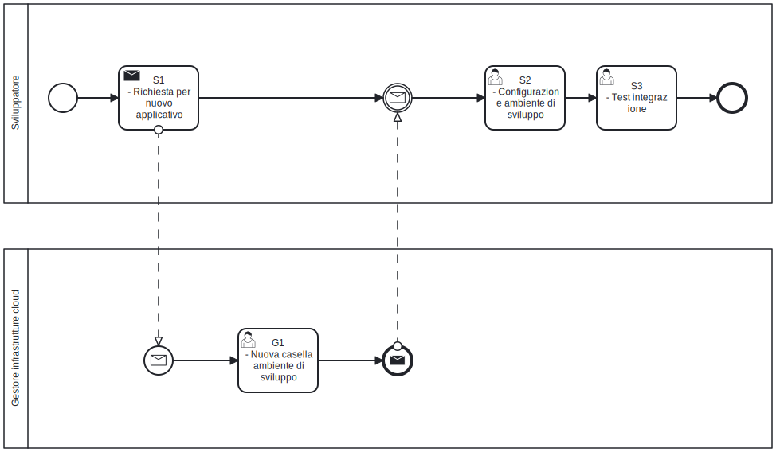

# Invio delle notifiche via Mail
In molti scenari risulta fondamentale poter notificare gli utenti in modo tempestivo ed efficace. Flussi di lavoro che coinvolgono figure come responsabili e assegnatari possono richiedere azioni in momenti diversi, rendendo necessario un sistema di comunicazione integrato.

L’email rappresenta ancora oggi il canale più diffuso e affidabile per raggiungere gli utenti. L'indirizzo email è attributo chiave nel framework SOUL. Proprio per questo, la notifica via mail è il mezzo più naturale per inviare comunicazioni, sfruttando dati già disponibili nel sistema.

Lo Starter Kit SOUL è progettato per semplificare questa esigenza, offrendo un’integrazione pronta all’uso tra gli applicativi distribuiti negli ambienti cloud e il servizio di invio mail di Ateneo. 

È importante però considerare che l’invio delle email in questo contesto segue una logica **best effort**: ciò significa che il sistema si impegna a trasmettere i messaggi, ma non garantisce né la consegna né la lettura da parte del destinatario. Fattori esterni come errori temporanei del server di posta, filtri antispam o caselle piene possono impedire il recapito della notifica, senza che il sistema applicativo ne abbia un controllo diretto.

Per questo motivo, lo sviluppatore è invitato a non basare logiche critiche o vincolanti esclusivamente sull’invio di email, ma a considerare canali alternativi o meccanismi di verifica dell’effettiva presa in carico dell’azione da parte dell’utente.

## Test di invio mail in ambiente di sviluppo e staging

Per il test della funzionalità di invio delle email in ambiente di sviluppo e staging è previsto l’utilizzo del servizio **Mailpit**, uno strumento leggero che intercetta e visualizza i messaggi inviati dall’applicazione senza recapitare email reali. Di seguito è riportata la configurazione del microservizio nel file `docker-compose.yml`.  Una volta avviato l'ambiente di sviluppo con `docker compose up`, l’interfaccia web del "finto" server di posta è raggiungibile all’indirizzo http://localhost/secure/mail

```yaml
  mailpit:
    image: axllent/mailpit:v1.29
    container_name: soul-mailpit
    environment:
      - MP_API_CORS=http://localhost:8025,http://127.0.0.1:8025
      - MP_WEBROOT=/secure/mail/
      - MP_DISABLE_HTTP_COMPRESSION=true
		# ....
```


## Workflow di integrazione

Lo sviluppatore configura l’ambiente locale predisponendo correttamente l’applicazione e generando il file di configurazione tramite la procedura prevista, ad esempio utilizzando l’endpoint dedicato alla creazione della configurazione. In questa fase deve assicurarsi che il sistema utilizzi un servizio di posta di test Mailpit, così da poter verificare l’invio delle email senza coinvolgere infrastrutture reali. Una volta completata la configurazione locale, lo sviluppatore esegue tutti i test funzionali necessari per validare il corretto funzionamento delle integrazioni email e dell’applicazione nel suo complesso.
Quando il sistema è pronto per il passaggio in staging, lo sviluppatore informa i referenti dell’infrastruttura cloud che l’applicazione richiede la configurazione del servizio di posta, fornendo eventuali dettagli tecnici utili. Dopo il deploy in staging, verifica che Mailpit sia correttamente configurato e funzionante, quindi svolge i test di integrazione per assicurarsi che tutto operi come previsto in un ambiente il più possibile simile alla produzione. Eventuali anomalie devono essere risolte prima di autorizzare il rilascio finale.
In vista della messa in produzione, lo sviluppatore si coordina con i gestori dell’infrastruttura affinché venga configurato il server SMTP istituzionale in sostituzione del sistema di test. Infine, verifica il corretto invio delle email in produzione e conferma l’entrata in esercizio del sistema.

Per consentire ai referenti dell’infrastruttura cloud di configurare l'invio dei messaggi via SMTP, l' `.env`file dell'applicazione deve contenere i seguenti attributi:

* **MAILER_FROM_ADDRESS**, `noreply@ml.unipd.it` è l'indirizzo mittente dei messaggi inviati agli utenti. Il mittente non è modificabile e il suo indirizzo deve suggerire all'utente finale che non è possibile rispondere alla mail inviata;
* **MAILER_HOST**, in ambiente di sviluppo e di staging è previsto l'invio al container SMTP locale **mailpit**, in questo caso l'hostname è `mailpit`.   Al momento del dispiegamento in produzione, l'hostname viene modificato dai gestori dell'infrastruttura cloud;
* **MAILER_SECURE**, in ambiente di sviluppo è impostato a `false`. Al momento del dispiegamento in staging e produzione, il valore può essere impostato a `true` dai gestori dell'infrastruttura cloud ad indicare che la comunicazione tra applicativo e SMTP server avviene in modo sicuro;
* **MAILER_PORT**, in ambiente di sviluppo è impostato a `1025` (default per mailpit). Tipicamente la porta default in caso di SMTP server e sicuro è `465`
* **MAILER_AUTH_USER**, in ambiente di sviluppo non è necessario. Al momento del dispiegamento in staging e produzione, l'utente viene modificato dai gestori dell'infrastruttura cloud;
* **MAILER_AUTH_PASSWORD**, in ambiente di sviluppo non è necessaria. Al momento del dispiegamento in staging e produzione, la password viene modificata dai gestori dell'infrastruttura cloud;

All'interno dello [Starter Kit](https://github.com/Piattaforme-Applicativi/soul-starter-kit) è disponibile un'interfaccia utente che semplifica la generazione del  file di configurazione. L'interfaccia utente è raggiungibile  nell'applicazione al path `/configuration/new`.

Dopo aver creato correttamente il file `.env`, si può procedere con il dispiegamento del sistema in ambiente di staging e in ambiente di produzione.

 

### Compiti dello sviluppatore

Segue l'elenco delle attività che lo sviluppatore deve portare a termine per integrare i nuovi applicativi con il sistema di notifiche via mail di Ateneo.

| Codice | Nome del compito          | Descrizione del compito                                      |
| :----: | ------------------------- | ------------------------------------------------------------ |
|   S1   | Configura ambiente locale | Lo sviluppatore configura l'ambiente di sviluppo per inviare messaggi al mailpit "locale" |
|   S2   | Richiesta di  deploy      | Lo sviluppatore informa i referenti dell’infrastruttura cloud che l’applicazione richiede la configurazione del servizio di posta, fornendo eventuali dettagli tecnici utili |
|   G1   | Deploy in staging         | I referenti dell’infrastruttura cloud configrano l'istanza di staging. L'istanza di staging è accompagnata da un microsevizio mailpit. I messaggi inviati via mail in ambiente di staging non vengono recapitati nelle caselle di posta dei destinatari. |
|   S3   | Test di integrazione      | Lo sviluppatore esegue i test di integrazione per assicurarsi che tutto operi come previsto in un ambiente il più possibile simile alla produzione. Eventuali anomalie devono essere risolte prima di autorizzare il rilascio finale |

# Esempio di notifica via Mail

La libreria [nodemailer](https://nodemailer.com) è parte dello Starter Kit. Lo sviluppatore può utilizzare direttamente i metodi e le funzioni della libreria per inviare messaggi via Mail. In alternativa la libreria `/nextjs/libs/notify.ts` propone la funzione `sendEmail` come forma di astrazione sulla libreria nodemailer.

Per inviare una notifica via Mail con `sendEmail` è necessario preparare un messaggio che risponde al formato dichiarato nell'interfaccia di classe `MailMessage`.

```typescript
// ....
import { MailMessage, sendEmail } from "@/libs/notify";
import { Global } from "@/libs/global";
import { t } from "@lingui/core/macro";
import { getI18nInstance } from "@/components/common/i18n/server";

// ....
export async function notify(): Promise<boolean> {
  const i18n = await getI18nInstance();
	const mailMessage: MailMessage = {
    from: Global.config.mailerFromAddress as string, // noreply.applicativi@unipd.it
    to: 'mario.rossi@company.com', // invia a MAILER_TO_ADDRESS di default quando impostato nella configurazione
    subject: i18n._(t`E' richiesta l'approvazione`),
    message: `${i18n._(t`Caro`)} Mario Rossi, ${i18n._(t`è richiesta la tua approvazione`)}<br/>
${i18n._(t`L'utente ha bisogno della tua approvazione per completare la richiesta.`)}<br/><br/>
${i18n._(t`Per favore`)} <a href="${Global.config.baseUrl}/request/${request.id}">${i18n._(t`controlla la richiesta`)}</a>`,
        };
  return sendEmail(mailMessage).then((result) => {
    return true;
  })
  .catch((error) => {
    console.error("Error sending email:", error);
    return false;
  });
}
// ...
```

