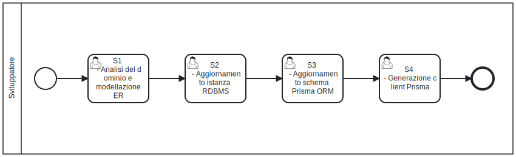

# Dati dell'applicazione
Le applicazioni SOUL devono gestire i dati dell'utente. Per i casi in cui è necessario dare garanzie di **A**tomicità, **C**oerenza, **I**solamento e **D**urabilità è possibile utilizzare l'RDBMS PostgreSQL. Adottando PostgreSQL è necessario prevedere una fase iniziale di modellazione della base dati. Lo [Starter Kit](https://github.com/Piattaforme-Applicativi/soul-starter-kit) offre un meccanismo di versionamento della banca dati, che dà allo sviluppatore la possibilità di perfezionare il modello per ampliare del dominio durante i successivi rilasci del prodotto software. Prisma ORM è la libreria Typescript adottata per comunicare con la banca dati e gestirne il versionamento. 

## Flusso di lavoro

A fronte della fase di analisi il team di sviluppo è in possesso di suffcienti informazioni per disegnare il modello Entità Relazione che descrive il dominio dell'applicazione. Dopo aver descritto il modello concettuale, il team di sviluppo traduce il modello astratto in un modello reale nella base dati RDBMS PostgresSQL. Per aggiornare l'istanza del database, il team di sviluppo genera i file con estensione .sql da eseguire in sequenza per migrare ad una versione successiva dello schema PostgresSQL. All'aggiornamento dell'istanza PostgreSQL segue l'aggiornamento del file descrittore di Prisma ORM.  A seguito dell'aggiornamento dello schema prisma, è utile generare nuovamente il client prisma nell'ambiente di sviluppo per propagare le modifiche in NextJS.



### Compiti dello sviluppatore

Segue l'elenco delle attività che derivano dalla raccolta di nuovi requisiti funzionali. In tutti i casi nei quali i la base dati del dominio cambia, lo sviluppatore deve eseguire le seguenti operazioni nell'ambiente di sviluppo.

| Codice | Nome del compito                           | Descrizione del compito                                      |
| :----: | ------------------------------------------ | ------------------------------------------------------------ |
|   S1   | Analisi del dominio e modellazione dell'ER | Lo sviluppatore formalizza il modello ER che descrive il dominio |
|   S2   | Aggiornamento istanza RDBMS                | Lo sviluppatore genera uno script .sql vuoto *nextjs/prisma/migrations/{timestamp}-{nuova-parte-db}*. All'interno dello script vuoto lo sviluppatore trascrive gli statement DDL e SQL per aggiornare l'istanza del database, con le modifiche nella nuova versione dell'ER al passo precedente. |
|   S3   | Aggiornamento schema Prisma ORM            | Lo sviluppatore aggiorna l'istanza del database per eseguendo lo script .sql creato in precedenza. A seguito dell'aggiornamento dell'istanza lo sviluppatore aggiorna lo schema Prisma ORM in *nextjs/prisma/schema.prisma* adeguando i nomi dei campi da Snake case a Camel case per rispettare [linee guida per la scrittura del codice sorgente](/stile-codice)) |
|   S4   | Generazione prisma client                  | Lo sviluppatore genera il client/driver prisma a partire dallo schema. Il file schema.prisma è un metadescrittore va pertanto generata la versione  in formato .js eseguibile dall'interprete javascript. |

Shell dei comandi da eseguire nel microservizio NextJS:

```bash
# Formalizzato il nuovo ER
# Accedo all'istanza nextjs
docker exec -it todo-nextjs sh

# S2 - Aggiornamento istanza RDBMS 
npx prisma migrate dev --create-only --name nuova-parte-db
# created: nextjs/prisma/migrations/{timestamp}-{nuova-parte-db}.sql
# Edit {timestamp}-{nuova-parte-db}.sql: Aggiungo nel file gli statement DDL e SQL per aggiornare l'istanza del database
npx prisma migrate deploy

# S3 - Aggiornamento schema Prisma ORM
npx prisma db pull
# Edit nextjs/prisma/schema.prisma: modifica manuale allo schema 

# S4 - Generazione prisma client
npx prisma generate
```

## Esempio di modellazione

Riportiamo di seguito un esempio di modellazione per un nuovo modulo software. Utilizziamo come esempio un generico modulo software per una domanda di prenotazione di un mezzo di trasporto. Dal punto di vista del dominio, in una domanda di prenotazione di un mezzo l'utente che sottopone una domanda deve indicare: il proprio indirizzo email; la tipologia di risorsa che deve essere prenotata (auto, bicicletta, monopattino), il tempo di utilizzo della risorsa. La data di presentazione della domanda deve essere assegnata automaticamente dal databse al omento del salvataggio. Un giornata può essere rappresentata dal momento temporale in slot temporali di 1.5 ore. Gli slot sono così definiti:

* Slot 1: 8:00 - 9:30
* Slot 2: 9:30 - 11:00
* Slot 3: 12:30 - 14:00
* Slot 4: 14:00 - 15:30
* Slot 5: 15:30 - 17:00
* Slot 6: 17:00 - 18:30

Il tempo di utilizzo della risorsa può essere indicato a giornata, riportando la data della prenotazione. In alternativa l'utente potrà indicare in quali slot desidera utilizzare la risorsa nell'arco di una giornata (eg: Giovedì 8 settembre 2025 negli slot 1,2,3).

Dovendo aggiungere una nuova funzionalità per la raccolta delle domande degli utenti possiamo creare un nuovo file per la migrazione/incremento funzionale dell'istanza del database.

```bash
# Accedo all'istanza nextjs
docker exec -it todo-nextjs sh

# S2 - Aggiornamento istanza RDBMS 
npx prisma migrate dev --create-only --name request
# new file: nextjs/prisma/migrations/20250501100000_request/migration.sql
```

Una volta creato il file .sql, aggiorniamo il contenuto con le modifiche da riportare nell'istanza del database locale.

```sql
-- Edit: nextjs/prisma/migrations/20250501100000_request/migration.sql

-- Tipologia risorsa: enum
CREATE TYPE resource_type AS ENUM ('car', 'bike', 'electric_scooter');

-- Tabella delle richieste
CREATE TABLE request (
    id SERIAL PRIMARY KEY,
    created_by VARCHAR(255) NOT NULL, -- email dell'utente che invia la domanda
    resource_type resource_type NOT NULL,
    booking_date DATE NOT NULL,
    booking_slot VARCHAR(11), -- ammessi valori separati da virgola 1,2,3,4,5,6, se NULL si indende prenotazione a giornata
    created_at TIMESTAMP NOT NULL DEFAULT CURRENT_TIMESTAMP,
  	updated_at TIMESTAMP NOT NULL DEFAULT CURRENT_TIMESTAMP,
  	CHECK (booking_slot ~* '^(?:[1-6]|[1-6](?:,[1-6]){1,5})$')
);
```

Dopo che ho definito quali sono i DDL che devono essere eseguiti in PostgresSQL per aggiornare l'istanza del database, posso usare il client prisma per aggiornare il database dell'ambiente di sviluppo (locale) e posso poi riportare le differenze generate dalla migrazione nello schema.prisma.

```bash
# S2 - Aggiornamento istanza RDBMS (locale)
npx prisma migrate deploy

# S3 - Aggiornamento schema Prisma ORM
npx prisma db pull
```

Segue la porzione di schema prisma che descrive il nuovo modulo applicativo

```sql
# nextjs/schema.prisma

enum ResourceType {
  car
  bike
  electric_scooter
}

model Request {
  id            Int           @id @default(autoincrement())
  created_by    String        @db.VarChar(255)
  resource_type ResourceType
  booking_date  DateTime      @db.Date
  booking_slot  String?       @db.VarChar(11) // opzionale, perché può mancare per uso giornaliero
  created_at    DateTime      @default(now())
  updated_at    DateTime      @default(now())

  @@check(booking_slot ~* '^(?:[1-6]|[1-6](?:,[1-6]){1,5})$')
}
```

Una volta estratti i descrittori nel file schema.prima devo aggiornare il contenuto per adegure [lo stile del codice](/stile-codice). A seguito dell'adeguamento lo schema.prisma riporterà i nomi dei campi e delle tabelle in **camelCase**

```sql
# nextjs/schema.prisma

enum resourceType {
  car
  bike
  electricScooter @map("electric_scooter")

  @@map("resource_type")
}

model request {
  id            Int           @id @default(autoincrement())
  createdBy     String        @db.VarChar(255) @map("created_by")
  resourceType  resourceType  
  bookingDate   DateTime      @db.Date @map("booking_date")
  bookingSlot   String?       @db.VarChar(11) @map("booking_slot")
  createdAt     DateTime @default(now()) @map("created_at")
  updatedAt     DateTime @default(now()) @map("updated_at")

  @@check(bookingSlot ~* '^(?:[1-6]|[1-6](?:,[1-6]){1,5})$')
  
}
```

L'ambiente di sviluppo và poi aggiornato per consentire alle componenti server-side React di utilizzare i nuovo oggetti pirma in formato Typescript/Javascript. 

```bash
# S4 - Generazione prisma client
npx prisma generate
```

Segue un'esempio di utilizzo di prisma per il nuovo oggetto request

```typescript
import Request from "@/types/request";

export async function listRequests(): Promise<Request[]> {
  try {
    return (
      await prisma.requuest.findMany({
        orderBy: {
          createdAt: "desc",
        }
      })
    ).map((r) => {
      return {
        id: r.id,
        createdBy: r.createdBy,
        resourceType: r.resourceType,
        bookingDate: r.bookingDate,
        bookingSlot: r.bookingSlot,
        createdAt: r.createdAt
      };
    });
  } catch (e) {
    console.error(`Failed to find the request: ${e}`);
    return [];
  }
}

```

