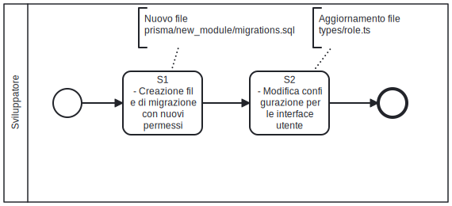

# I permessi
Nel framework SOUL, le funzionalità del sistema sono organizzate secondo un paradigma modulare: ogni nuova sezione o gruppo coerente di funzionalità è incapsulato in un modulo software. Questo approccio favorisce la manutenibilità, la scalabilità e l’organizzazione del codice.

Per garantire un controllo granulare degli accessi, ogni modulo adotta un modello di permessi basato sul paradigma CRUD (Create, Read, Update, Delete), ovvero le quattro operazioni fondamentali per la gestione dei dati. A ciascuna di queste operazioni corrisponde un livello distinto di autorizzazione.

Il sistema di gestione dei permessi si basa inoltre su un modello RBAC (Role-Based Access Control), nel quale i diritti di accesso non vengono assegnati direttamente agli utenti, ma ai ruoli. Ogni ruolo può avere uno o più permessi associati e può essere assegnato a uno o più utenti. Questo consente una gestione più efficiente e sicura dei privilegi all’interno dell’applicazione.

Ogni nuovo modulo deve quindi essere accompagnato da una definizione esplicita dei permessi CRUD necessari per il suo utilizzo, che saranno integrati nel sistema RBAC.

### Registrazione di un nuovo modulo e il meccanismo di controllo degli accessi

In SOUL, il controllo di accesso alle funzionalità è realizzato **lato server**. Questo approccio è stato scelto per garantire un livello di sicurezza elevato, impedendo ai client di aggirare i meccanismi di controllo degli accessi.

Le funzionalità sono organizzate in **moduli software**, ognuno dei quali espone determinate operazioni. L’accesso a queste operazioni è regolato attraverso un sistema di **permessi CRUD** (Create, Read, Update, Delete), secondo il modello **RBAC** (Role-Based Access Control), in cui i permessi sono assegnati ai ruoli, non direttamente agli utenti.

#### Registrazione dei permessi per un nuovo modulo

- Ogni nuovo modulo deve dichiarare esplicitamente i permessi necessari per ciascuna delle sue funzionalità;
- La **registrazione dei permessi** deve avvenire al momento del rilascio del modulo utente;
- Una volta registrati, il **modulo di gestione ruoli e permessi**, già incluso nello starter kit, provvederà a gestirli durante la creazione o l’aggiornamento dei ruoli nel sistema;
- Il **modulo di gestione dei ruoli** permette allo sviluppatore di creare **ruoli di sistema**. I ruoli di sistema non possono essere eliminati o modificati dall'utente. Ai ruoli di sistema possono essere assegnati utenti del sistema. 

#### Autenticazione e autorizzazione

- Dopo l'autenticazione, l’identità dell’utente e i permessi associati al suo ruolo vengono **memorizzati in un cookie lato server**. Il cookie ha una scadenza che può essere modificata nel file *.env* di NextJS;
- Questo cookie è utilizzato per autorizzare le richieste successive in modo sicuro e centralizzato.

# Flusso di lavoro

Quando si avvia lo sviluppo di un nuovo modulo all'interno dello starter kit, il primo passo fondamentale è la definizione dei permessi di accesso alle funzionalità del modulo. Questo processo coinvolge sia la parte backend, responsabile della gestione dei permessi nel database, sia la parte frontend, che consente la visualizzazione e la selezione dei permessi nell'interfaccia utente dedicata alla gestione dei ruoli.

Lo sviluppatore deve innanzitutto estendere il tipo enumerato *role_permission* che rappresenta i permessi nel sistema, aggiungendo i permessi CRUD (creazione, lettura, aggiornamento e cancellazione) relativi al nuovo modulo. Questo permette al database di riconoscere e gestire le nuove azioni legate al modulo.

Successivamente, può essere utile assegnare questi nuovi permessi a uno o più ruoli predefiniti, registrandoli nella tabella che associa i ruoli ai permessi. In questo modo, i ruoli esistenti possono fin da subito interagire con il nuovo modulo secondo i diritti stabiliti.

Dopo aver definito i permessi nel backend, è necessario aggiornarli anche nella configurazione lato frontend. In particolare, devono essere elencati all'interno del file che definisce i permessi visibili e selezionabili nell’interfaccia di gestione dei ruoli. Questo passaggio consente agli utenti amministratori di assegnare o revocare i nuovi permessi tramite l’interfaccia grafica, garantendo coerenza tra sistema e interfaccia utente.



### Compiti dello sviluppatore

| Codice | Nome del compito                                             | Descrizione del compito                                      |
| :----: | ------------------------------------------------------------ | ------------------------------------------------------------ |
|   S1   | Creazione del file di migrazione con i nuovi permessi        | Lo sviluppatore decide quali sono i permessi per il nuovo modulo (Create, Read, Update, Delete). Genera poi uno script .sql vuoto *nextjs/prisma/migrations/{timestamp}-{nuova-parte-db}*. All'interno dello script vuoto lo sviluppatore trascrive gli statement DDL e SQL per aggiornare l'istanza del database. |
|   S2   | Modifica delle configurazione per le interfacce utente di gestione dei ruoli | Lo sviluppatore aggiorna il file *nextjs/types/role.ts* aggiungendo i nuovi permessi del modulo. |

# Esempio di registrazione di nuovi permessi per un modulo

L'esempio di registrazione dei permessi per nuovo modulo viene fatta a partire dalla modellazione dei dati già presentata alla sezione [esempio di modellazione della base dati](/orm#esempio-di-modellazione). Il nuovo modulo dell'applicativo tratterà una domanda di prenotazione di un mezzo. La nuova domanda di prenotazione di risorsa presentata da un utente conterrà: l'indirizzo email dell'utente; la tipologia di risorsa che deve essere prenotata  (auto, bicicletta, monopattino), il tempo di utilizzo della risorsa.

## Creazione del file di migrazione con i nuovi permessi

Dovendo aggiungere nuovi permessi per la raccolta delle domande degli utenti possiamo creare un nuovo file per la migrazione/incremento funzionale dell'istanza del database.

```bash
# Accedo all'istanza nextjs
docker exec -it todo-nextjs sh

# Aggiornamento istanza RDBMS 
npx prisma migrate dev --create-only --name request-permissions
# new file: nextjs/prisma/migrations/20250605100000_request-permissions/migration.sql
```

Una volta creato il file .sql, aggiorniamo il contenuto con le modifiche da riportare nell'istanza del database locale.

```sql
-- Edit: nextjs/prisma/migrations/20250605100000_request-permissions/migration.sql

-- Aggiornamento dell'ENUM che elenca tutti i possibili permessi dell'applicazione
ALTER TYPE permission_type ADD VALUE 'request_create';
ALTER TYPE permission_type ADD VALUE 'request_read';
ALTER TYPE permission_type ADD VALUE 'request_update';
ALTER TYPE permission_type ADD VALUE 'request_delete';
```

Dopo che ho definito quali sono i DDL che devono essere eseguiti in PostgresSQL per aggiornare l'istanza del database, posso usare il client prisma per aggiornare il database dell'ambiente di sviluppo (locale) e posso poi riportare le differenze generate dalla migrazione nello schema.prisma.

```bash
# Aggiornamento istanza RDBMS (locale)
npx prisma migrate deploy

# Aggiornamento schema Prisma ORM
npx prisma db pull
```

Segue la porzione di schema prisma che descrive il nuovo modulo applicativo

```sql
# nextjs/schema.prisma

enum permissionType {
  all        @map("all")
  roleManage @map("role_manage")
  request_create
  request_read
  request_update
  request_delete
  request_all

  @@map("permission_type")
}
```

Una volta estratti i descrittori nel file schema.prima devo aggiornare il contenuto per adegure [lo stile del codice](/stile-codice). A seguito dell'adeguamento lo schema.prisma riporterà i nomi dei campi e delle tabelle in **camelCase**

```sql
# nextjs/schema.prisma

enum permissionType {
  all           @map("all")
  roleManage    @map("role_manage")
  requestCreate @map("request_create")
  requestRead   @map("request_read")
  requestUpdate @map("request_update")
  requestDelete @map("request_delete")
  requestAll    @map("request_all")

  @@map("permission_type")
}
```

L'ambiente di sviluppo và poi aggiornato per consentire alle componenti server-side React di utilizzare i nuovo oggetti pirma in formato Typescript/Javascript. 

```bash
# Generazione prisma client
npx prisma generate
```

## Modifica delle configurazione per le interfacce utente di gestione dei ruoli

Una volta definiti i permessi per il nuovo modulo nella base dati è conveniente registrarli nell'interfaccia utente di gestione dei ruoli. In questo modo gli utenti che hanno il permesso di creare, modificare o eliminare i ruoli potranno **assengare i permessi ad un gruppo di utenti** creando un nuovo ruolo.

Il file che permette di registrare i permessi e le loro traduzioni è *nextjs/types/role.ts*. All'interno del file la funzione *appPermissions* ritorna, nell'interfaccia utente di gestione dei ruoli, tutti i permessi definiti per un modulo dell'applicativo.

```typescript
// nextjs/types/role.ts

export const appPermissions = (): AppPermissionsType => {
  return {
    role: {
      label: t`Role management`,
      permissions: [
        {
          permission: permissionType.roleManage,
          description: t`Manage role, permissions for users`,
        },
      ],
    },
    // .....
    // Dichiarazionne dei permessi per il nuovo modulo request
    request: {
    	label: t`Requests`,
      permissions: [
        {
          permission: permissionType.requestCreate,
          description: t`Create new request`,
        },
        {
          permission: permissionType.requestRead,
          description: t`Read all request`,
        },
        // ..... requestUpdate, requestDelete
      ],
    }
    // ...
  }
}
```

## OPZIONALE: Nuovo ruolo di sistema

Nella fase di analisi di un nuovo sistema software, emergono gli scenari di utilizzo. Un modo comune di descrivere gli scenari di utilizzo, è attraverso la definizione di un **ruolo utente** che svolge una o più operazioni nel sistema:

* L'**utente finale** può inoltrare una nuova richiesta di prenotazione di un mezzo di trasporto. L'**utente finale** può erroneamente dichiarare il mezzo o l'orario di prenotazione.  L'**utente finale** deve poter consultare le *proprie domande* ed eliminare o modificare la domanda errata;
* Il **gestore delle prenotazioni** visualizza le domande di tutti gli utenti. Una volta esaminata la domanda il gestore delle prenotazioni può decidere di bloccare il veicolo per l'utente che ha eseguito la prenotazione.

Ne consegue che un applicativo software viene sviluppato a partire della **operazioni che un ruolo utente svolge**. Esistono pertanto dei ruoli predefiniti per il sistema, questi ruoli caratterizzono i diversi modi in cui il sistema verrà utilizzato. 

Dall'esempio precedente emergono due ruoli: **Utente finale**, **Gestore delle prenotazioni**. Ad ognuno di questi ruoli sono associati i **permessi definiti per il modulo richiesta**.  Questi ruoli sono predefiniti per il sistema perchè descrivono gli scenari di utilizzo per i quali il sistema software è stato progettato. Il flag *deletable* impostanto a FALSE, impedisce agli utenti che accedono all'interfaccia utente di gestione dei ruoli di modificare il comportamento previsto per questo ruolo utente.

```sql
-- Ruoli predefiniti per il sistema
INSERT INTO "role" (id, "role", deletable) VALUES(nextval('role_id_seq'::regclass), 'Utente finale', FALSE); -- 1
INSERT INTO "role" (id, "role", deletable) VALUES(nextval('role_id_seq'::regclass), 'Gestore delle prenotazioni', FALSE); -- 2

-- Aggiunta dei permessi al ruolo "Utente finale"
INSERT INTO role_permission (role_id, permission) VALUES(1,'request_create');
INSERT INTO role_permission (role_id, permission) VALUES(1,'request_read');
INSERT INTO role_permission (role_id, permission) VALUES(1,'request_update');
INSERT INTO role_permission (role_id, permission) VALUES(1,'request_delete');

-- Aggiunta dei permessi al ruolo "Gestore delle prenotazioni"
INSERT INTO role_permission (role_id, permission) VALUES(2,'request_all');
```

