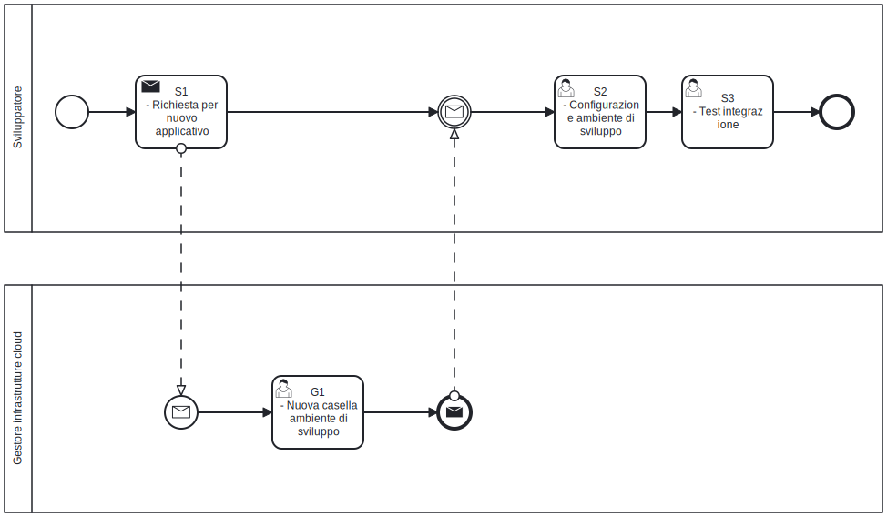

# Invio delle notifiche via Mail
In molti scenari risulta fondamentale poter notificare gli utenti in modo tempestivo ed efficace. Flussi di lavoro che coinvolgono figure come responsabili e assegnatari possono richiedere azioni in momenti diversi, rendendo necessario un sistema di comunicazione integrato.

L’email rappresenta ancora oggi il canale più diffuso e affidabile per raggiungere gli utenti. L'indirizzo email è attributo chiave nel framework SOUL. Proprio per questo, la notifica via mail è il mezzo più naturale per inviare comunicazioni, sfruttando dati già disponibili nel sistema.

Lo Starter Kit SOUL è progettato per semplificare questa esigenza, offrendo un’integrazione pronta all’uso tra gli applicativi distribuiti negli ambienti cloud e il servizio di invio mail di Ateneo.

È importante però considerare che l’invio delle email in questo contesto segue una logica **best effort**: ciò significa che il sistema si impegna a trasmettere i messaggi, ma non garantisce né la consegna né la lettura da parte del destinatario. Fattori esterni come errori temporanei del server di posta, filtri antispam o caselle piene possono impedire il recapito della notifica, senza che il sistema applicativo ne abbia un controllo diretto.

Per questo motivo, lo sviluppatore è invitato a non basare logiche critiche o vincolanti esclusivamente sull’invio di email, ma a considerare canali alternativi o meccanismi di verifica dell’effettiva presa in carico dell’azione da parte dell’utente.

## Workflow di integrazione

Per integrare correttamente il sistema, lo sviluppatore deve inviare ai gestori dell'infrastruttura cloud di Ateneo una richiesta per l'integrazione con il sistema di invio Mail . I gestori dell'infrastruttura generano un nuovo utente e ritornano allo sviluppatore i parametri per configurare l'ambiente di sviluppo.

Ricevuti i parametri lo sviluppatore crea un nuovo file `.env`, che contiene le configurazioni necessarie. Gli attributi da modificare sono:

* **MAILER_FROM_ADDRESS**, `noreply.applicativi@unipd.it` è l'indirizzo mittente dei messaggi inviati agli utenti. Il mittente non è modificabile e il suo indirizzo deve suggerire all'utente finale che non è possibile rispondere alla mail inviata;
* **MAILER_TO_ADDRESS**, è l'indirizzo del destinatario quando dobbiamo simulare l'invio di messaggi. E' una buona pratica impostare l'indirizzo nella configurazione degli ambienti di test e sviluppo.;
* **MAILER_HOST**, in ambiente di sviluppo è previsto l'utilizzo dell'SMTP `smtprelay-production.unipd.cloud`. Al momento del dispiegamento in staging e produzione, l'hostname viene modificato dai gestori dell'infrastruttura cloud;
* **MAILER_SECURE**, di base è impostato a `true` e stà ad indicare che il canale di comunicazione tra applicativo e SMTP server e sicuro;
* **MAILER_PORT**, la porta default in caso di SMTP server e sicuro è `465`
* **MAILER_AUTH_USER**, l'utente comunicato dai gestori dell'infrastruttura cloud a fronte della richiesta di integrazione SMTP di un nuovo applicativo;
* **MAILER_AUTH_PASSWORD**,la password comunicata dai gestori dell'infrastruttura cloud a fronte della richiesta di integrazione SMTP di un nuovo applicativo.

All'interno dello [Starter Kit](https://github.com/Piattaforme-Applicativi/soul-starter-kit) è disponibile un'interfaccia utente che semplifica la generazione del  file di configurazione. L'interfaccia utente è raggiungibile  nell'applicazione al path `/configuration/new`.

Dopo aver creato correttamente il file `.env`, si può procedere con il dispiegamento del sistema sia in ambiente di staging che in produzione.

 

### Compiti dello sviluppatore

Segue l'elenco delle attività che lo sviluppatore deve portare a termine per integrare i nuovi applicativi con il sistema di notifiche via mail di Ateneo.

| Codice | Nome del compito                    | Descrizione del compito                                      |
| :----: | ----------------------------------- | ------------------------------------------------------------ |
|   S1   | Richiesta per un nuovo applicativo  | Lo sviluppatore contatta il team DevOps all’indirizzo `helpdesk@donq.io` . Lo sviluppatore deve specificare nella richiesta che l’applicazione che stà sviluppando necessita di essere integrata con il sistema di notifica mail di Ateneo (in modalità SMTP). |
|   G1   | Nuova casella ambiente di sviluppo  | I gestori dell'infrastruttura cloud di Ateneo provvedono a generare le credenziali per l'ambiente di sviluppo e **le comunicano allo sviluppatore**. Inoltre, si occupano di aggiornare le procedure di dispiegamento dell'applicativo, inserendo i parametri corretti per la connessione al sistema di notifica via mail, in base all’ambiente di destinazione (staging o produzione). |
|   S2   | Configurazione ambiente di sviluppo | Lo sviluppatore aggiorna il file `.env` modificando i parametri per la connessione al server SMTP |
|   S3   | Test di integrazione                | Lo sviluppatore esegue i test di integrazione per quelle funzionalità che richiedono l'invio di notifiche via mail |

# Esempio di notifica via Mail

La libreria [nodemailer](https://nodemailer.com) è parte dello Starter Kit. Lo sviluppatore può utilizzare direttamente i metodi e le funzioni della libreria per inviare messaggi via Mail. In alternativa la libreria `/nextjs/libs/notify.ts` propone la funzione `sendEmail` come forma di astrazione sulla libreria nodemailer.

Per inviare una notifica via Mail con `sendEmail` è necessario preparare un messaggio che risponde al formato dichiarato nell'interfaccia di classe `MailMessage`.

```typescript
// ....
import { MailMessage, sendEmail } from "@/libs/notify";
import { Global } from "@/libs/global";
import { t } from "@lingui/macro";

// ....
export async function notify(): Promise<boolean> {
	const mailMessage: MailMessage = {
    from: Global.config.mailerFromAddress as string, // noreply.applicativi@unipd.it
    to: 'mario.rossi@company.com', // invia a MAILER_TO_ADDRESS di default quando impostato nella configurazione
    subject: t`Approval is required`,
    message: `${t`Dear`} Mario Rossi, ${t`your approval is required`}<br/>
${t`For the request to be valid you need to approve it.`}<br/><br/>
${t`Please`} <a href="${Global.config.baseUrl}/request/${request.id}">${t`check the request for approval`}</a>`,
        };
  return sendEmail(mailMessage).then((result) => {
    return true;
  })
  .catch((error) => {
    console.error("Error sending email:", error);
    return false;
  });
}
// ...
```

